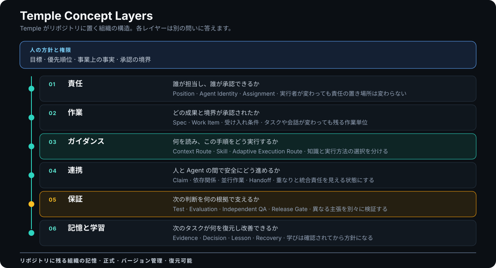
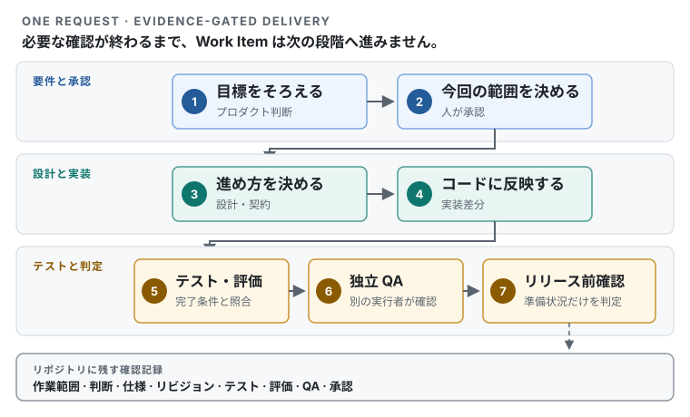

<h1 align="center">Temple</h1>

<p align="center"><strong>AI 開発組織フレームワーク</strong></p>

<p align="center">一つひとつの変更に、責任者と進め方と根拠を。</p>

<p align="center"><a href="README.md">English</a> · <strong>日本語</strong> · <a href="README.zh-TW.md">繁體中文</a></p>

<p align="center">
  <a href="https://github.com/zsz1210/temple-ai-dev-org/actions/workflows/ci.yml"></a>
  &nbsp;·&nbsp; Early Alpha
  &nbsp;·&nbsp; Node.js 24 以降
  &nbsp;·&nbsp; <a href="LICENSE">MIT</a>
</p>

---

## AI で実装は速くなる。難しいのは、仕事をつなぐこと。

AI は計画、実装、テスト、レビューを進められます。しかし、複数のタスク、会話、人、AI が同時に動き始めると、本当に難しいのは組織上の問いです。

- この変更の責任者は誰か。
- 実際に承認された範囲はどこまでか。
- どの仕事なら安全に同時進行できるか。
- どのリビジョンをテストしたのか。
- 次の担当者は何を読み、何を無視してよいのか。
- 今回の学びは再利用できるのか、それとも一度限りの事情だったのか。

Temple は、開発組織をプロジェクトのリポジトリ内に残します。責任、作業状態、必要な文脈、仕事の進め方、引き継ぎ、検証記録、学びを会話の外に保存するため、別の人や AI が古いチャットを再構成せずに続きから作業できます。

Temple はアプリケーションフレームワークでも、課題管理ツールでも、自律的に指揮するマネージャーでもありません。プロジェクト固有のアーキテクチャ、技術スタック、文書、ツールはそのまま使い、Temple はその周囲で人と AI がどう協力するかを定めます。

> **プロダクトをどう作るかは、プロジェクトが決めます。仕事をどう組織し、検証し、次へ残すかを Temple が整えます。**

## Temple がリポジトリに置く組織

<picture>
  <source media="(max-width: 640px)" srcset="docs/assets/temple-layers-mobile.ja.svg">
  
</picture>

Temple は巨大な一つのプロンプトでも、自律的な一体の Agent でもありません。人の方針を最上位に置き、リポジトリに残る状態を土台にします。その間の各レイヤーが、責任、承認された作業、方法、連携、検証、学習をつなぎながら、同じものとして混ぜないようにします。

ガイダンスには、意図的に二つの異なるルートがあります。**Context Routing** は、現在の Position と手順が何を読むべきかを決めます。**Adaptive Execution Routing** は、Task Shape、必要な能力、制約、プロジェクト方針から、その範囲内の手順をどう実行すべきかを決めます。現在の Alpha が返すのは説明可能な要求設定であり、Provider を起動したり、モデルを黙って切り替えたりはしません。詳しくは[アーキテクチャ（英語）](docs/concepts/architecture.md#three-routes-three-decisions)と[モデルルーティングガイド（英語）](docs/getting-started/model-routing.md)を参照してください。

## Temple がプロジェクトに加えるもの

- **変わらない責任の置き場所：** Position は、担当する人や AI が交代しても、責任と権限の境界を保ちます。
- **範囲を持つ作業：** すべての変更を、スコープ、依存関係、受け入れ条件、状態を持つ Work Item として扱います。
- **必要な文脈だけを渡す：** Context Routing が、現在の Position と手順に必要な仕様、判断、Skill、検証記録へ案内します。
- **説明できる実行方法：** Adaptive Execution Routing は手順が必要とする能力から、条件に合うプロジェクト所有の実行プロファイルを選びます。Position にモデルを固定しません。
- **根拠をそろえてから進む：** 実装、評価、Independent QA、リリース準備を別々の結論として記録します。
- **安全な並行作業：** 独立した作業は同時に進め、重なる作業は調整と明確な統合責任者を待ちます。
- **信頼できる学習：** Lesson は再検証を経て、必要なときだけ Practice や Skill へ昇格します。成功例が自動的に規則になることはありません。

これらの約束はコードと同じリポジトリに残ります。Jira、GitHub Projects、Figma、既存の仕様書、社内文書は、それぞれが管理してきた情報の正式な保管場所であり続けられます。

## 一つの変更が Temple を通る流れ

<picture>
  <source media="(max-width: 640px)" srcset="docs/assets/temple-delivery-path.ja-mobile.svg">
  
</picture>

Work Item は、次の段階に必要な根拠がそろったときだけ先へ進みます。判断と検証結果は作業中からリポジトリに蓄積され、Release Gate で後から都合のよい事実を作るわけではありません。

## 一つのプロジェクトから始める

必要なものは Git、Node.js 24 以降、Codex、導入先のプロジェクトディレクトリです。CI では Node.js 24 を基準環境として検証します。

現在の Temple はソースからインストールします。

```bash
git clone https://github.com/zsz1210/temple-ai-dev-org.git
cd temple-ai-dev-org
npm ci
npm run verify
npm link
```

Codex で Temple を開き、次のように依頼します。

> [`$temple-init`](docs/getting-started/core-skills.md#temple-init) を使って `/absolute/path/to/my-project` を初期化してください。既存のブランチ運用、レビュー、統合ルールを先に確認し、不足している情報のうち実行方法に影響する点だけを質問してください。その後、Agent Identity の英語名と統合方法の要約を提示し、私の確認を待ってからファイルを書き込んでください。

既存の GitHub、GitLab、または社内の開発フローが引き続き正式なルールです。Temple が記録するのは AI の作業に必要な運用の要約だけであり、GitHub Flow を強制したり、ホスティングサービスの設定を変更したりはしません。

初期化したプロジェクトでは、まず一つの成果に範囲を絞ります。

> [`$decision-interview`](docs/getting-started/core-skills.md#decision-interview) で今回の変更を明確にし、次に [`$temple-work`](docs/getting-started/core-skills.md#temple-work) で独立して検証できる最小の Work Item を作成してください。

作成された組織の状態はローカルで確認できます。

```bash
node ./templew.mjs doctor .
node ./templew.mjs status .
node ./templew.mjs observe .
```

Temple は各プロダクトのリポジトリへ導入します。プロダクトごとにフレームワークを fork する必要はありません。

このリポジトリ直下の `.ai-org/` は、Temple が自らの開発を管理してきた記録です。判断、分担、検証を実際にどのように残しているか確認できるよう、公開リポジトリにも保持します。この self-host 記録はリリースパッケージには含まれず、別のプロダクトへコピーされることもありません。初期化した各プロジェクトは、それぞれ独自の状態を作成して管理します。

## 一つの運用モデルを、異なる規模で使う

- **Solo** — 一人が AI 支援開発を主導します。少数の Agent Identity で複数の Position を担当できますが、Developer と Independent QA は分けます。
- **Collaborative** — 複数の人がそれぞれの AI を使います。スポンサー、担当資格、共有リソース、claim、統合責任を明示します。
- **High-Assurance** — 障害時の事業・運用上の影響が大きい場合に使います。リスクに応じた検証、より強い身分分離、ロールバック準備、複数の人による承認を追加します。

規模が変わっても中心概念は同じです。新しい工程へ総入れ替えするのではなく、リスクが必要とする分離と根拠だけを追加します。

## 拡張するのは仕事の方法。権限ではない

Temple の Skill は、再利用できるエンジニアリング手法です。プロダクト探索、ドメインモデリング、UI、実装、テスト、レビュー、文書作成など、範囲の明確な仕事を案内できます。プロジェクト独自の Skill をコードのそばに追加することもできます。

Skill は許可を与えず、依存関係を承認せず、工程上のゲートを迂回しません。記録した Lesson も、それだけでプロジェクト全体の規則にはなりません。Temple は観察、再検証、意図的な昇格、権限を分けることで、成功例を無条件に恒久ルールへ変えずに学習します。

[Capability catalog（英語）](docs/extensions/capability-catalog.md)、[Skill authoring guide（英語）](docs/extensions/skill-authoring.md)、[Engineering Learning Loop（英語）](docs/extensions/engineering-learning.md)も参照してください。

## 現在の成熟度

Temple は、有人監督のある低リスクなローカルプロジェクトと、範囲を限定した試行を対象とする **Early Alpha** です。

- **現在利用できるもの：** リポジトリ中心の Solo ワークフロー、安定した Position、Work Item、決定的なコンテキスト・Capability ルーティング、説明可能で実行を伴わない Adaptive Execution Routing、管理された Skill と学習、ライフサイクル証拠、ローカル状態確認、アップグレード境界。
- **実験中または限定的なもの：** Collaborative と High-Assurance の契約、並行計画、Provider の観測とキャリブレーション、ローカル Control Plane、外部トラッカー連携、Work Item 単位の使用量帰属。
- **まだ保証していないもの：** 大規模な複数人・複数マシン運用、本番監視や自動修復、無人の外部書き込み、自動モデルルーティング、規制環境での受け入れ、あらゆるプロジェクトに共通する時間・Token 削減効果。

ローカルテストに合格しただけで企業利用が証明されたとは扱わず、残っている検証不足もそのまま公開します。

## 次に読むもの

- [Usage guide（英語）](docs/getting-started/usage.md) — 導入、運用、アップグレード、トラブルシューティング。
- [Temple terminology（英語）](docs/concepts/terminology.md) — Position、Agent Identity、Work Item、Evidence、運用プロファイル。
- [Architecture（英語）](docs/concepts/architecture.md) — リポジトリ境界と正式な状態。
- [Documentation map（英語）](docs/README.md) — コラボレーション、UI モード、トラッカー、品質保証、学習、検証、意思決定。
- [Contributing（英語）](CONTRIBUTING.md)、[Code of Conduct（英語）](CODE_OF_CONDUCT.md)、[Security（英語）](SECURITY.md) — 参加方法と、行為上の問題や脆弱性を非公開で報告する窓口。

## 最終判断は人に残る

Temple は仕事を調整し、根拠を保存できます。しかし、事業上の事実、優先順位、認証情報、支出、取り消せない外部操作、本番修復、高リスクな承認を自分で決めることはありません。

## License

[MIT](LICENSE)。第三者由来の情報と導入上の境界は [THIRD_PARTY_NOTICES.md](THIRD_PARTY_NOTICES.md) に記録しています。
