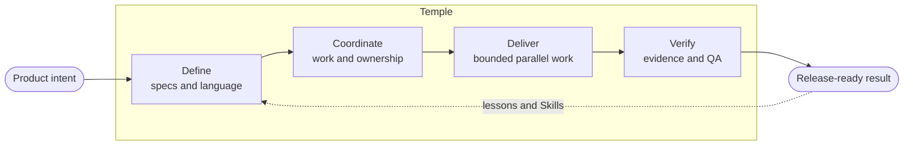

# Temple — AI Development Organization Framework

[English](README.md) | **日本語** | [繁體中文](README.zh-TW.md)

**分断された AI coding session を、記憶し、連携し、検証し、学習できる開発組織へ。**

Temple は、新規または既存 project に repository-native な operating framework を導入します。Solo developer から multi-team organization まで、人と AI Agent に安定した責任、永続的な project context、再利用可能な engineering method、境界の明確な work、evidence-based release gate を提供します。

> [!NOTE]
> Temple は現在、human supervision のある low-risk local project と bounded pilot 向けの early alpha です。Distributed enterprise operation、production monitoring、無人の external action はまだ実証済み capability として主張しません。

## なぜ Temple が必要なのか

Agent の数を増やすだけでは、優れた engineering team にはなりません。

共通の operating model がなければ、別 task が同じ作業を繰り返し、product decision は chat の中に消え、Agent は同じ file を編集し、implementation claim と approval が混同されます。Repository、specialist、tracker、conversation が増えるほど問題は大きくなります。

Temple は coordination layer を repository に残します。

- **責任が conversation を越えて残る。** 一つの AI が複数 Position を担当しても、product、design、architecture、implementation、evaluation、QA、release、observation の責任を分離します。
- **Context に参照先がある。** Specification、decision、Work Item、handoff、learning、evidence を、過去の chat を再構築せず回復できます。
- **Parallel work に境界がある。** Dispatch 前に dependency、affected path、shared contract、resource、Integration Owner を定義します。
- **Method を成長させられる。** Review されていない prompt を増やすのではなく、governed extension contract の下で Skill を使用、追加、作成します。
- **Completion が evidence を意味する。** Developer verification、evaluation、Independent QA、human approval、release readiness は exact revision に結び付く別々の step です。

Temple は shared chat log でも prompt 集でもありません。Product intent と、それを届ける人・Agent の間にある operating layer です。

## 規模が変わっても一つの operating loop



Project が成長しても loop は変わりません。変わるのは各 Position を担う Agent Identity と specialist の数、必要な evidence の深さ、そしてどの外部 system を authority として維持するかです。

## 利用状況別の Temple

<details>
<summary><strong>複数の AI Agent を使う Solo developer</strong></summary>

一人の developer が、Temple の十個の安定した Position を五つの名前付き Agent Identity に割り当てられます。同じ AI が複数の責任を持っても、Developer と Independent QA は見える形で分離します。Repository state により、新しい task は元の conversation に依存せず作業を回復できます。

これは現在もっとも強く検証されている境界です。Human supervision のある local かつ bounded な利用です。

</details>

<details>
<summary><strong>Product と engineering の collaborative team</strong></summary>

Product Manager、designer、frontend engineer、backend engineer、infrastructure engineer、full-stack engineer は、それぞれ sponsored AI Agent を通じて作業できます。Team-visible outcome は company tracker に残し、internal Work Item は discipline、dependency、affected path、shared contract ごとに AI execution を分けます。Integration Owner は dependent work の前に exact candidate revision を統合します。

Workflow と local coordination contract は実装済みです。Retained multi-human／multi-machine test はまだ pending です。

</details>

<details>
<summary><strong>Enterprise または multi-repository organization</strong></summary>

Temple は Jira、GitHub Projects、Figma、既存 specification、repository convention の廃止を要求しません。それらを authoritative なまま維持し、各 project で bounded AI execution、evidence、reconciliation を記録できます。Portfolio と multi-repository view も project-local authority を保つ必要があります。

将来の enterprise extension には SRE / Security responsibility、read-only production telemetry、incident / vulnerability coordination、policy evidence、operational risk review を含みます。これは roadmap の方向であり、現在の production-monitoring capability の主張ではありません。

</details>

## 再設計せず assignment で scale する

Temple は十個の安定した Position を定義します。

| Product と design | Engineering と delivery | Assurance と visibility |
|---|---|---|
| Product Manager | Engineering Manager | Quality & Evaluation Engineer |
| UX Designer | Tech Lead | Independent QA |
| UI Designer | Developer | Release Manager |
|  |  | Observer |

**Position** は責任の contract、**Agent Identity** は project-specific な executor です。**Discipline** は frontend、backend、infrastructure、full-stack、data、SRE、Security などの specialization を表します。**Skill** は再利用可能な method であり、authority を与えたり gate を迂回したりできません。

| Profile | Typical shape | 追加される safeguard |
|---|---|---|
| **Solo** | 少数の Identity が複数 Position を担当 | Durable context と責任分離の可視化 |
| **Collaborative** | Human が specialist Agent と Position pool を sponsor | Claim、discipline、dependency、resource、integration ownership |
| **High-Assurance** | Sensitive work で厳格に Identity を分離 | Risk-scaled evidence、rollback、distinct approval、human accountability |

Template には character name を固定しません。Initialization が project ごとの Agent Identity 名を提案または受け取り、後から Position contract を変えずに Identity を追加・分割できます。

## Quick start

Requirements: Git、Node.js 20 以降、Codex、target project directory。

```bash
git clone https://github.com/zsz1210/temple-ai-dev-org.git
cd temple-ai-dev-org
npm ci
npm run verify
npm link
```

Temple を Codex で開き、次のように依頼します。

> `$temple-init` を使って `/absolute/path/to/my-project` を initialize してください。Agent Identity の英語名を提案し、file を書く前に私の確認を待ってください。

Initialized project 内では次のように依頼します。

> `$decision-interview` でこの change を明確にし、`$temple-work` で independently verify できる最小の Work Item を作成してください。

```bash
node ./templew.mjs doctor .
node ./templew.mjs status .
node ./templew.mjs observe .
```

Product ごとに framework を fork するのではなく、各 project に Temple を install します。Installed project state はその product に属し、framework-managed file は独立して upgrade できます。

> [!TIP]
> Solo profile と一つの bounded outcome から始めてください。Agent、discipline、integration、厳格な gate は、project が本当に必要とした時に追加します。

Adoption、upgrade、self-hosting、parallel work、tracker、UI mode、troubleshooting は [Usage guide（英語）](docs/getting-started/usage.md) を参照してください。

## Project とともに成長する engineering method

Core には initialization、bounded delivery、decision interview、domain modeling、project documentation、Skill authoring の Skill が含まれます。Optional pack は test-driven development や systematic debugging などの method を追加できます。

[Engineering Learning Loop（英語）](docs/extensions/engineering-learning.md) は Lesson と Practice を記録し、繰り返し得られた evidence を Skill、check、ADR、instruction へ昇格させます。[Skill authoring contract（英語）](docs/extensions/skill-authoring.md) は trigger、authority、provenance、scenario、validation を定義し、framework が local method の ownership を奪わずに project を拡張できるようにします。

Temple は、すべての engineering Skill、design tool、tracker integration、model、RAG system、daemon を default では導入しません。

## Marketing より先に evidence

現在の claim は automated repository check と bounded validation record に基づきます。すべての enterprise topology、regulated audit、distributed race、production deployment を証明するものではありません。

将来の比較 test では、明示的な baseline に対する context-recovery time、duplicate scope、rework、blocked time、verification defect、token usage、coordination effort を測定します。それまでは時間や token の削減率を主張しません。

- [Roadmap と retained gap（英語）](docs/planning/roadmap.md)
- [Testing strategy（英語）](docs/getting-started/testing.md)
- [Validation records（英語）](docs/validation/README.md)

## Human authority を明示的に残す

Temple は repository work を coordinate しますが、business truth、priority、credential、material spending、irreversible external action、production remediation、high-risk approval の ownership を持ちません。External tracker と operational system は workflow に情報を与えられますが、自動的な release authority にはなりません。

## Documentation

[Documentation map（英語）](docs/README.md) から始めてください。

- [Vision（英語）](docs/concepts/vision.md)
- [Architecture（英語）](docs/concepts/architecture.md)
- [Collaborative development（英語）](docs/operations/collaboration.md)
- [Capability catalog（英語）](docs/extensions/capability-catalog.md)
- [Architecture decisions（英語）](docs/adr/README.md)
- [Changelog（英語）](CHANGELOG.md)

## License

[MIT](LICENSE)。Third-party source と adoption boundary は [THIRD_PARTY_NOTICES.md](THIRD_PARTY_NOTICES.md) に記録します。
