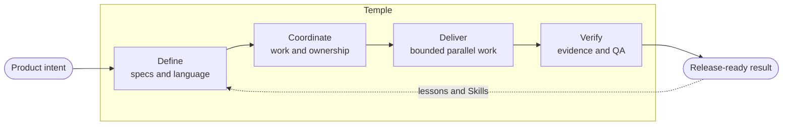

<h1 align="center">Temple</h1>

<p align="center"><strong>AI Development Organization Framework</strong></p>

<p align="center">Turn disconnected AI coding sessions into a development organization that can remember, coordinate, verify, and improve.</p>

<p align="center"><strong>English</strong> · <a href="README.ja.md">日本語</a> · <a href="README.zh-TW.md">繁體中文</a></p>

<p align="center">
  <a href="https://github.com/zsz1210/temple-ai-dev-org/actions/workflows/ci.yml"></a>
  &nbsp;·&nbsp; Early Alpha
  &nbsp;·&nbsp; Node.js 20+
  &nbsp;·&nbsp; <a href="LICENSE">MIT License</a>
</p>

Temple installs a repository-native operating framework into a new or existing project. It gives people and AI agents stable responsibilities, durable project context, reusable engineering methods, bounded work, and evidence-based release gates—from a solo builder to a multi-team organization.

> [!NOTE]
> Temple is an early alpha for low-risk local projects and bounded pilots with human supervision. Distributed enterprise operation, production monitoring, and unattended external actions are not yet claimed.

---

## Why Temple?

More agents do not automatically create a better engineering team.

Without a shared operating model, one task repeats another, product decisions disappear inside chats, agents collide on the same files, and implementation claims become confused with approval. The problem grows as repositories, specialists, trackers, and conversations multiply.

Temple keeps the coordination layer in the repository:

- **Responsibility survives the conversation.** Product, design, architecture, implementation, evaluation, QA, release, and observation remain distinct even when one AI fills several Positions.
- **Context has an address.** Specifications, decisions, Work Items, handoffs, learning, and evidence can be recovered without reconstructing an old chat.
- **Parallel work has boundaries.** Dependencies, affected paths, shared contracts, resources, and an Integration Owner are declared before dispatch.
- **Methods can evolve.** Projects use, add, and author Skills under a governed extension contract rather than accumulating unreviewed prompts.
- **Completion means evidence.** Developer verification, evaluation, Independent QA, human approval, and release readiness are separate, exact-revision steps.

Temple is not a shared chat log and not a bag of prompts. It is the operating layer between product intent and the humans and agents that deliver it.

## One operating loop, at any scale



The loop stays the same as a project grows. What changes is how many Agent Identities and specialists occupy each Position, how much evidence is required, and which systems remain authoritative.

---

## Who is Temple for?

<details>
<summary><strong>Individual developers</strong></summary>

Use Temple when one person asks several AI agents to plan, build, review, and continue the same project. Instead of leaving requirements, decisions, Work Items, handoffs, and evidence across disconnected conversations, Temple keeps them in the repository so a new task can recover the work.

You do not need ten separate agents. One AI may cover several Positions while the project is small; development and independent verification remain separate so an implementation does not approve itself. This human-supervised solo workflow is Temple's most thoroughly validated use today.

</details>

<details>
<summary><strong>Development teams</strong></summary>

Product, design, frontend, backend, infrastructure, and full-stack contributors can each work with their own AI agents without forcing the whole team into one conversation. Temple gives each Work Item an owner, dependencies, affected paths, and shared contracts. Independent work can run in parallel, then an Integration Owner joins the exact candidate revisions.

Jira, GitHub Projects, or another company tracker can remain the team-visible source of progress while Temple records the finer-grained AI work and evidence in the repository. The coordination workflow is implemented; the retained multi-human, multi-machine validation is still pending.

</details>

<details>
<summary><strong>Enterprises</strong></summary>

Adopting Temple does not require replacing Jira, GitHub Projects, Figma, existing specifications, or repository conventions. Each project can keep its current sources of truth while Temple records bounded AI execution, evidence, and reconciliation beside the work. Portfolio and multi-repository views can aggregate status without taking authority away from each repository.

Future enterprise extensions include SRE and Security responsibilities, read-only production telemetry, incident and vulnerability coordination, policy evidence, and operational risk review. These remain roadmap directions, not current production-monitoring capabilities.

</details>

## Scale by assignment, not by redesign

Temple defines ten stable Positions:

| Product and design | Engineering and delivery | Assurance and visibility |
|---|---|---|
| Product Manager | Engineering Manager | Quality & Evaluation Engineer |
| UX Designer | Tech Lead | Independent QA |
| UI Designer | Developer | Release Manager |
|  |  | Observer |

A **Position** is a responsibility contract. An **Agent Identity** is a project-specific executor. A **Discipline** describes a specialization such as frontend, backend, infrastructure, full-stack, data, SRE, or Security. A **Skill** is a reusable method; it cannot grant authority or bypass a gate.

| Profile | Typical shape | Added safeguards |
|---|---|---|
| **Solo** | A few identities cover several Positions | Durable context and visible separation of responsibilities |
| **Collaborative** | Humans sponsor specialist agents and Position pools | Claims, disciplines, dependencies, resources, and integration ownership |
| **High-Assurance** | Sensitive work has stricter identity separation | Risk-scaled evidence, rollback, distinct approvals, and human accountability |

The template ships without character names. Initialization proposes or accepts names for that project's Agent Identities; teams can add or split identities later without changing the Position contracts.

---

## Quick start

Requirements: Git, Node.js 20 or later, Codex, and a target project directory.

### 1. Install Temple from source

```bash
git clone https://github.com/zsz1210/temple-ai-dev-org.git
cd temple-ai-dev-org
npm ci
npm run verify
npm link
```

### 2. Initialize a project

Open Temple in Codex and ask:

> Use `$temple-init` to initialize `/absolute/path/to/my-project`. Propose English names for the Agent Identities and wait for my confirmation before writing files.

### 3. Start the first Work Item

Inside the initialized project, ask:

> Use `$decision-interview` to clarify this change, then use `$temple-work` to create the smallest Work Item that can be independently verified.

```bash
node ./templew.mjs doctor .
node ./templew.mjs status .
node ./templew.mjs observe .
```

You install Temple into each project; you do not fork the framework for every product. The installed project state belongs to that product, while managed framework files remain upgradeable.

> [!TIP]
> Start with the Solo profile and one bounded outcome. Add more agents, disciplines, integrations, or stricter gates only when the project actually needs them.

See the [usage guide](docs/getting-started/usage.md) for adoption, upgrades, self-hosting, parallel work, trackers, UI modes, and troubleshooting.

## Engineering methods that can grow

The core includes Skills for initialization, bounded delivery, decision interviews, domain modeling, project documentation, and Skill authoring. Optional packs can add methods such as test-driven development and systematic debugging.

The [Engineering Learning Loop](docs/extensions/engineering-learning.md) captures Lessons and Practices before promoting repeated evidence into a Skill, check, ADR, or instruction. The [Skill authoring contract](docs/extensions/skill-authoring.md) defines triggers, authority, provenance, scenarios, and validation so a project can extend Temple without giving the framework ownership of local methods.

Temple deliberately does not install every engineering Skill, design tool, tracker integration, model, RAG system, or daemon by default.

---

## Evidence before marketing

Current claims are backed by automated repository checks and bounded validation records. They do not prove every enterprise topology, regulated audit, distributed race, or production deployment.

Future comparative tests should measure context-recovery time, duplicate scope, rework, blocked time, verification defects, token usage, and coordination effort against an explicit baseline. Until those tests exist, Temple will not claim a percentage of time or tokens saved.

- [Roadmap and retained gaps](docs/planning/roadmap.md)
- [Testing strategy](docs/getting-started/testing.md)
- [Validation records](docs/validation/README.md)

## Human authority remains explicit

Temple coordinates repository work; it does not own business truth, priorities, credentials, material spending, irreversible external actions, production remediation, or high-risk approval. External trackers and operational systems can inform the workflow without becoming automatic release authority.

---

## Documentation

Start with the [documentation map](docs/README.md), then use:

- [Vision](docs/concepts/vision.md)
- [Architecture](docs/concepts/architecture.md)
- [Collaborative development](docs/operations/collaboration.md)
- [Capability catalog](docs/extensions/capability-catalog.md)
- [Architecture decisions](docs/adr/README.md)
- [Changelog](CHANGELOG.md)

## License

[MIT](LICENSE). Third-party sources and adoption boundaries are documented in [THIRD_PARTY_NOTICES.md](THIRD_PARTY_NOTICES.md).
