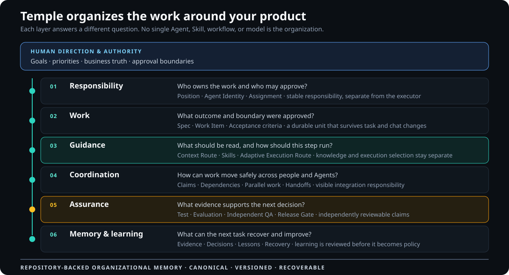

<h1 align="center">Temple</h1>

<p align="center"><strong>AI Development Organization Framework</strong></p>

<p align="center">Give every change an owner, a method, and evidence.</p>

<p align="center"><strong>English</strong> · <a href="README.ja.md">Japanese</a> · <a href="README.zh-TW.md">Traditional Chinese</a></p>

<p align="center">
  <a href="https://github.com/zsz1210/temple-ai-dev-org/actions/workflows/ci.yml"></a>
  &nbsp;·&nbsp; Early Alpha
  &nbsp;·&nbsp; Node.js 24+
  &nbsp;·&nbsp; <a href="LICENSE">MIT</a>
</p>

---

## Software moves faster with AI. Coordination does not.

AI agents can plan, code, test, and review. But once a project has several tasks, conversations, people, or agents in motion, the difficult questions are organizational:

- Who owns this change?
- What was actually approved?
- Can these tasks run together safely?
- Which revision was tested?
- What should the next agent read—and what can it ignore?
- Which lesson is reusable, and which was true only once?

Temple gives a software project a durable development organization inside its repository. It keeps responsibility, work state, context, methods, handoffs, evidence, and learning outside chat so another person or AI can continue without reconstructing the project from old conversations.

Temple is not an application framework, issue tracker, or autonomous manager. Your project keeps its own architecture, stack, documents, and tools. Temple defines how humans and AI work together around them.

> **Your project decides how the product is built. Temple defines how the work is organized, verified, and remembered.**

## The organization Temple puts in your repository

<picture>
  <source media="(max-width: 640px)" srcset="docs/assets/temple-layers-mobile.en.svg">
  
</picture>

Temple is a layered operating model, not one large prompt or one autonomous Agent. Human direction remains above the system; durable repository state sits below it. The layers in between keep ownership, approved work, methods, coordination, verification, and learning connected without treating them as the same thing.

The Guidance layer deliberately contains two different routes. **Context Routing** answers what the current Position and step should read. **Adaptive Execution Routing** answers how that bounded step should be attempted, using its Task Shape, required capabilities, constraints, and project policy. The current Alpha produces explainable requested settings; it does not launch a Provider or silently switch the model. See the [architecture](docs/concepts/architecture.md#three-routes-three-decisions) and [model-routing guide](docs/getting-started/model-routing.md).

## What Temple adds to a project

- **Stable responsibilities:** Positions define ownership and authority without tying them permanently to one person or AI.
- **Bounded work:** every change becomes a Work Item with scope, dependencies, acceptance criteria, and a durable state.
- **Relevant context:** Context Routing points each Position to the specifications, decisions, Skills, and evidence needed for the current step.
- **Explainable execution choices:** Adaptive Execution Routing selects an eligible project-owned execution profile from the step's needs; responsibility never hard-codes a model.
- **Evidence-gated delivery:** implementation, evaluation, Independent QA, and release readiness remain separate claims.
- **Safe parallel work:** independent tasks can run together; overlapping work waits for coordination and an explicit integration owner.
- **Learning that earns trust:** Lessons can be captured, revalidated, and deliberately promoted into Practices or Skills instead of silently becoming rules.

Temple stores these contracts beside the code. Jira, GitHub Projects, Figma, existing specifications, and company documents can remain authoritative for the subjects they already own.

## One change through Temple

<picture>
  <source media="(max-width: 640px)" srcset="docs/assets/temple-delivery-path.en-mobile.svg">
  
</picture>

A Work Item advances only when the next stage has the evidence it requires. Repository records accumulate throughout the change; the Release Gate does not create project truth after the fact.

## Start with one project

Requirements: Git, Node.js 24 or later, Codex, and a project directory. Node.js 24 is the CI baseline.

Temple is currently installed from source:

```bash
git clone https://github.com/zsz1210/temple-ai-dev-org.git
cd temple-ai-dev-org
npm ci
npm run verify
npm link
```

Open Temple in Codex, then ask:

> Use [`$temple-init`](docs/getting-started/core-skills.md#temple-init) to initialize `/absolute/path/to/my-project`. Inspect the repository's existing branch, review, and integration policy first; ask only about missing choices that affect execution. Then propose English names for the Agent Identities and a short integration summary, and wait for my confirmation before writing files.

The project's existing GitHub, GitLab, or company workflow remains authoritative. Temple records only the confirmed routing summary its Agents need; it does not impose GitHub Flow or change repository-hosting settings.

Inside the initialized project, begin with one bounded outcome:

> Use [`$decision-interview`](docs/getting-started/core-skills.md#decision-interview) to clarify this change, then use [`$temple-work`](docs/getting-started/core-skills.md#temple-work) to create the smallest Work Item that can be independently verified.

Inspect the resulting organization locally:

```bash
node ./templew.mjs doctor .
node ./templew.mjs status .
node ./templew.mjs observe .
```

You install Temple into each project; you do not fork the framework for every product.

The root `.ai-org/` in this repository is Temple's own auditable self-hosting record. It remains visible so readers can inspect how the framework manages its own development. This self-host state is excluded from the release package and is not copied into another product project; each initialized project creates and owns its own state.

## One operating model, different scales

- **Solo** — one person directs AI-assisted development. A small set of Agent Identities can cover several Positions, while Developer and Independent QA stay separate.
- **Collaborative** — several people operate their own agents. Sponsorship, eligible responsibility pools, shared resources, claims, and integration ownership become explicit.
- **High-Assurance** — failure has higher operational or business impact. Temple adds risk-scaled evidence, stronger identity separation, rollback readiness, and distinct human approvals.

Temple uses the same core concepts at each scale. Teams add separation and evidence when the risk requires it instead of replacing the organization with a new process.

## Extend the methods, not the authority boundary

A Temple Skill is a reusable engineering method: it can guide product discovery, domain modeling, UI work, implementation, testing, review, documentation, or another bounded practice. Projects can add their own Skills and keep them beside the code.

Skills do not grant permission, approve dependencies, or bypass delivery gates. A captured Lesson also does not automatically become a project-wide rule. Temple separates observation, revalidation, deliberate promotion, and authority so the organization can learn without turning every successful experiment into permanent policy.

See the [Capability catalog](docs/extensions/capability-catalog.md), [Skill authoring guide](docs/extensions/skill-authoring.md), and [Engineering Learning Loop](docs/extensions/engineering-learning.md).

## Current maturity

Temple is an **Early Alpha** intended for human-supervised, low-risk local projects and bounded pilots.

- **Available now:** repository-native Solo workflow, stable Positions, Work Items, deterministic context and capability routing, explainable non-executing Adaptive Execution Routing, governed Skills and learning, lifecycle evidence, local status, and upgrade boundaries.
- **Experimental or bounded:** collaborative and high-assurance contracts, parallel planning, Provider observation and calibration, local control-plane views, tracker coordination, and per-Work-Item usage attribution.
- **Not yet claimed:** broad multi-human and multi-machine qualification, production monitoring or remediation, unattended external writes, automatic model routing, regulated acceptance, or measured universal time and Token savings.

The framework reports retained gaps instead of treating a passing local test as enterprise proof.

## Read next

- [Usage guide](docs/getting-started/usage.md) — adoption, operation, upgrades, and troubleshooting.
- [Temple terminology](docs/concepts/terminology.md) — Positions, Agent Identities, Work Items, Evidence, and profiles.
- [Architecture](docs/concepts/architecture.md) — repository boundaries and canonical state.
- [Documentation map](docs/README.md) — collaboration, UI modes, trackers, assurance, learning, validation, and decisions.
- [Contributing](CONTRIBUTING.md), [Code of Conduct](CODE_OF_CONDUCT.md), and [Security](SECURITY.md) — contribution expectations and private reporting routes.

## Human authority remains explicit

Temple can coordinate work and preserve evidence. It does not own business truth, priorities, credentials, spending, irreversible external actions, production remediation, or high-risk approval.

## License

[MIT](LICENSE). Third-party sources and adoption boundaries are documented in [THIRD_PARTY_NOTICES.md](THIRD_PARTY_NOTICES.md).
