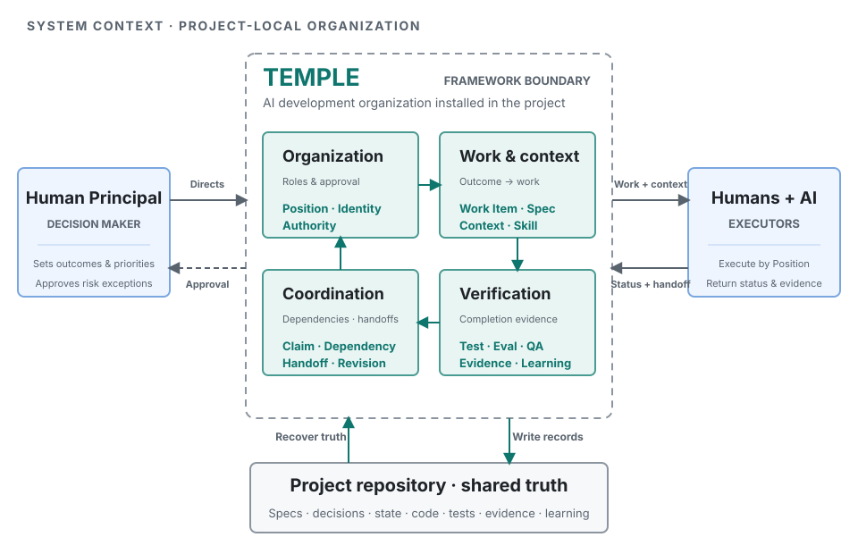

<h1 align="center">Temple</h1>

<p align="center"><strong>AI Development Organization Framework</strong></p>

<p align="center">Give a software project a development organization where humans and AI can work together, keep learning, and deliver with evidence.</p>

<p align="center"><strong>English</strong> · <a href="README.ja.md">日本語</a> · <a href="README.zh-TW.md">繁體中文</a></p>

<p align="center">
  <a href="https://github.com/zsz1210/temple-ai-dev-org/actions/workflows/ci.yml"></a>
  &nbsp;·&nbsp; Early Alpha
  &nbsp;·&nbsp; Node.js 20+
  &nbsp;·&nbsp; <a href="LICENSE">MIT License</a>
</p>

<p align="center"><a href="#how-temple-organizes-development">How it works</a> · <a href="#quick-start">Quick start</a> · <a href="#maturity">Current limits</a></p>

---

## What is Temple?

AI can plan, write code, test, and review. Dependable software development also needs product direction, clear responsibility and authority, repeatable engineering methods, coordinated work, independent verification, and project memory that improves over time.

Temple keeps that operating model in the project repository. It is not a reporting hierarchy or a fixed organization chart. It is a shared way for a project to decide, divide work, execute, verify, and learn—whether the project has one developer, several AI agents, or a larger team.

### Use Temple with an existing project or a new one

Temple is not a web, mobile, or backend application framework. It does not prescribe a programming language, development framework, cloud service, or project-management tool. You can add it to a project already in development or adopt it when starting a new one. Your project still decides its product architecture, application code, dependencies, data model, and deployment approach.

Temple adds a traceable way to organize AI-assisted development. It defines what people and AI are responsible for, which decisions require human approval, how work is divided and handed off, what evidence must support completion, and how proven methods become reusable knowledge. It adds organizational and collaboration files to the repository; it does not require the product to be rewritten around a Temple-specific application architecture.

> **In short: your project decides how the product is built; Temple defines how people and AI work together to deliver it.**

> [!NOTE]
> Temple is an Early Alpha. It is best suited to low-risk local projects and bounded pilots with human supervision. Broad multi-human and multi-machine qualification, production monitoring, and unattended external actions are not yet claimed.



<a id="how-temple-organizes-development"></a>

## How Temple organizes development

Temple connects six concerns that are often split across chats, tools, and people:

- **Product direction:** what problem is real and what outcome is approved.
- **Responsibility and authority:** who owns the work and who may approve it.
- **Engineering methods:** how this kind of work should be performed.
- **Work coordination:** what is active, blocked, dependent, or safe to run together.
- **Verification and delivery:** what evidence supports completion and release readiness.
- **Learning and memory:** what the next task can recover, reuse, or revalidate.

Three principles keep the system understandable:

1. **The repository is the shared project memory.** Chats are useful workspaces, but specifications, decisions, work state, handoffs, tests, and approvals remain recoverable outside them.
2. **Responsibility is separate from the executor.** A stable responsibility can move between people or AI without rewriting the project’s operating model.
3. **Done means evidence.** Implementation, testing, evaluation, Independent QA, and release readiness are distinct steps tied to a known revision.

Temple does not replace Jira, GitHub Projects, Figma, existing specifications, or repository conventions. Those systems can remain authoritative for the subjects they own while Temple records bounded AI-assisted work and verification beside the code.

## One request through Temple



For each request, Temple keeps one bounded unit of work, the context and methods it needs, its owner, its handoffs, and the evidence required for the next stage. Safe independent work may run in parallel; dependent work rejoins through exact revisions and an explicit integration owner.

The decisions, evidence, and reusable learning remain in the repository so another person, AI, task, or machine can recover the current truth without treating an old conversation as authority.

## Make Token use and model choice evidence-based

When an execution environment exposes usage metadata, Temple can associate each Work Item's Token usage with its verified model when available, responsible Position, lifecycle stage, and outcome. This reveals usage drivers and may produce a low-confidence shadow candidate, but naturally completed tasks are not automatically comparable.

A project can also register a **matched evaluation**: different model profiles attempt the same cases, for the same task shape and source revision, under one quality rubric. Temple applies the quality gate first, then compares Tokens, latency, rework, and human intervention. If the project's statistical decision contract also passes, Temple can expose a project-qualified, read-only advisory. A lower-Token candidate that fails quality cannot win.

Temple does not run those evaluations through a provider, switch a task's model, rewrite project policy, or pool calibration data across projects. This repository currently has no configured matched-evaluation source, so Temple makes no real model recommendation for its own development yet. Automatic routing remains later work and requires separate execution, approval, fallback, and validation boundaries.

See [Token efficiency and model routing](docs/operations/token-efficiency-and-model-routing.md) for the measurement, privacy, recommendation, and automation boundaries.

## One operating model at different scales

| Profile | Use it when | What changes |
|---|---|---|
| **[Solo](docs/concepts/terminology.md#solo)** | One person is directing AI-assisted development | A few Agent Identities cover several responsibilities; development and Independent QA stay separate. |
| **[Collaborative](docs/concepts/terminology.md#collaborative)** | Several people operate their own agents | Sponsorship, eligible responsibility pools, claims, disciplines, resources, and integration ownership become explicit. |
| **[High-Assurance](docs/concepts/terminology.md#high-assurance)** | The work has higher operational or business risk | Identity separation, risk-scaled evidence, rollback readiness, and distinct human approvals become stricter. |

Solo is the most thoroughly validated profile today. Collaborative and High-Assurance contracts are implemented and locally tested, but real large-scale multi-human and multi-machine qualification remains open.

### Responsibilities scale without redesigning the organization

Temple defines ten stable Positions:

| Product and experience | Engineering delivery | Assurance and release |
|---|---|---|
| Product Manager | Engineering Manager | Quality & Evaluation Engineer |
| UX Designer | Tech Lead | Independent QA |
| UI Designer | Developer | Release Manager |
|  |  | Observer |

Any Position can have no active worker, one default worker, or a larger eligible pool, depending on the selected profile and project policy. One person or AI may cover several Positions, but Developer and Independent QA must use different Agent Identities for the same work.

### Four terms you need first

| Temple term | Plain meaning |
|---|---|
| **[Position](docs/concepts/terminology.md#position)** | A stable contract for responsibility and approval boundaries. |
| **[Agent Identity](docs/concepts/terminology.md#agent-identity)** | A project-specific person or AI that can perform work. |
| **[Work Item](docs/concepts/terminology.md#work-item)** | One bounded outcome with scope, ownership, state, and acceptance evidence. |
| **[Evidence](docs/concepts/terminology.md#evidence)** | A revision-linked record that supports a test, review, approval, or delivery claim. |

A Skill is a reusable engineering method. It can guide how work is performed, but it cannot grant authority, approve a dependency, or bypass a lifecycle gate.

<a id="quick-start"></a>

## Quick start

Requirements: Git, Node.js 20 or later, Codex, and a target project directory.

### 1. Install Temple from source

```bash
git clone https://github.com/zsz1210/temple-ai-dev-org.git
cd temple-ai-dev-org
npm ci
npm run verify
npm link
```

### 2. Initialize a project

Open the Temple repository in Codex and ask. The `$name` form tells Codex to use a [Temple Core Skill](docs/getting-started/core-skills.md); it is not a terminal command.

> Use [`$temple-init`](docs/getting-started/core-skills.md#temple-init) to initialize `/absolute/path/to/my-project`. Propose English names for the Agent Identities and wait for my confirmation before writing files.

Temple adds a visible operating layer to the target project:

- [`TEMPLE.md`](docs/concepts/terminology.md#temple-md) and Position configurations define responsibility and authority boundaries.
- [`.ai-org/`](docs/concepts/terminology.md#ai-org) stores project-owned identities, Work Items, context routes, evidence, learning, and rebuildable views.
- [`templew.mjs`](docs/concepts/terminology.md#templew) and [`temple.lock`](docs/concepts/terminology.md#temple-lock) pin framework execution and exact managed-file ownership.
- [Core Skills](docs/getting-started/core-skills.md) provide repeatable methods while project-specific Skills remain project-owned.

### 3. Start the first Work Item

Inside the initialized project, ask:

> Use [`$decision-interview`](docs/getting-started/core-skills.md#decision-interview) to clarify this change, then use [`$temple-work`](docs/getting-started/core-skills.md#temple-work) to create the smallest Work Item that can be independently verified.

Then inspect the project locally:

```bash
node ./templew.mjs doctor .
node ./templew.mjs status .
node ./templew.mjs observe .
```

You install Temple into each project; you do not fork the framework for every product. Start with Solo and one bounded outcome. Add more agents, disciplines, integrations, or stricter gates only when the project needs them.

See the [usage guide](docs/getting-started/usage.md) for adoption, upgrades, self-hosting, parallel work, trackers, UI modes, and troubleshooting.

<a id="maturity"></a>

## What is ready today?

| Status | Current boundary |
|---|---|
| **Available now** | Human-supervised Solo workflow, ten stable Positions with flexible Assignments, Work Items and lifecycle gates, deterministic context and capability routing, governed Skills and learning, evidence records, local status, and upgrade/recovery boundaries. |
| **Experimental or bounded** | Collaborative and High-Assurance contracts, safe parallel planning, provider status, per-Work-Item Token and model observation, low-confidence shadow candidates, project-configured matched-evaluation advisories, read-only tracker and portfolio coordination, and the local control plane have repository tests or bounded local validation—not general organizational qualification. |
| **Planned or unverified** | Real large multi-human and multi-machine operation, production monitoring or remediation, unattended external writes, automatic model routing, cross-project learning, configured semantic retrieval, regulated acceptance, and broad enterprise proof. |

Current claims come from automated repository checks and bounded validation records. They do not prove every enterprise topology, regulated audit, distributed race, or production deployment. Temple does not claim a percentage of time or tokens saved without a measured baseline.

## Learn more by goal

| I want to… | Start here |
|---|---|
| Understand Temple-specific terms | [Temple terminology](docs/concepts/terminology.md) |
| Understand the `$name` methods used in prompts | [Temple Core Skills](docs/getting-started/core-skills.md) |
| Understand the full operating model | [Vision](docs/concepts/vision.md) |
| Inspect the system and engineering boundaries | [Architecture](docs/concepts/architecture.md) |
| Install, adopt, or upgrade Temple | [Usage guide](docs/getting-started/usage.md) |
| Coordinate several people and their AI agents | [Collaborative development](docs/operations/collaboration.md) |
| Understand tests, evidence, and release readiness | [Evidence and Observer](docs/operations/evidence-and-observer.md) |
| Understand Token usage and model calibration | [Token efficiency and model routing](docs/operations/token-efficiency-and-model-routing.md) |
| Add or create engineering methods | [Capability catalog](docs/extensions/capability-catalog.md) and [Skill authoring](docs/extensions/skill-authoring.md) |
| Understand learning and deliberate Skill promotion | [Engineering Learning Loop](docs/extensions/engineering-learning.md) |
| See current limits and retained gates | [Roadmap](docs/planning/roadmap.md) and [Validation records](docs/validation/README.md) |

The complete [documentation map](docs/README.md) also links Architecture Decision Records, contribution guidance, security policy, changelog, research, and pilot evidence.

## Human authority remains explicit

Temple coordinates repository work. It does not own business truth, priorities, credentials, material spending, irreversible external actions, production remediation, or high-risk approval. External systems may inform the workflow without becoming automatic lifecycle or release authority.

## License

[MIT](LICENSE). Third-party sources and adoption boundaries are documented in [THIRD_PARTY_NOTICES.md](THIRD_PARTY_NOTICES.md).
