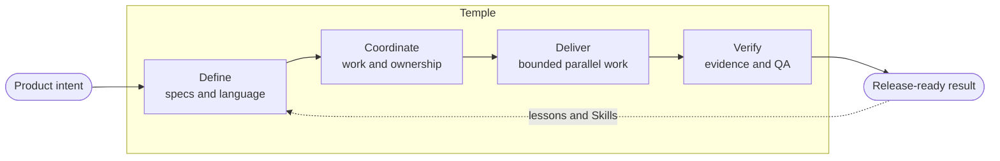

<h1 align="center">Temple</h1>

<p align="center"><strong>AI Development Organization Framework</strong></p>

<p align="center">把彼此斷裂的 AI coding session，變成能記憶、協作、驗證與持續進步的開發組織。</p>

<p align="center"><a href="README.md">English</a> · <a href="README.ja.md">日本語</a> · <strong>繁體中文</strong></p>

<p align="center">
  <a href="https://github.com/zsz1210/temple-ai-dev-org/actions/workflows/ci.yml"></a>
  &nbsp;·&nbsp; Early Alpha
  &nbsp;·&nbsp; Node.js 20+
  &nbsp;·&nbsp; <a href="LICENSE">MIT License</a>
</p>

Temple 會在新的或既有的專案裡安裝一套 repository-native operating framework。從個人開發者到 multi-team organization，它讓人類與 AI Agent 擁有穩定責任、可長期保存的 project context、可重用的 engineering method、邊界清楚的工作，以及 evidence-based release gate。

> [!NOTE]
> Temple 目前仍是 early alpha，適合在人類監督下進行 low-risk local project 與 bounded pilot。Distributed enterprise operation、production monitoring 與無人執行的 external action 尚未被宣稱為已驗證能力。

---

## 為什麼需要 Temple？

增加 Agent 數量，不會自動形成更好的 engineering team。

缺少共同 operating model 時，不同 task 會重複相同工作，product decision 會消失在對話裡，Agent 可能同時修改同一批檔案，implementation claim 也容易與 approval 混在一起。Repository、specialist、tracker 與 conversation 越多，問題就越嚴重。

Temple 把 coordination layer 留在 repository 裡：

- **責任能跨越 conversation 保存。** 即使同一個 AI 暫時擔任多個 Position，product、design、architecture、implementation、evaluation、QA、release 與 observation 仍然分開。
- **Context 有可查找的位置。** Specification、decision、Work Item、handoff、learning 與 evidence 不必靠重建舊對話才能恢復。
- **Parallel work 有清楚邊界。** Dispatch 前先定義 dependency、affected path、shared contract、resource 與 Integration Owner。
- **Method 可以持續成長。** 專案透過 governed extension contract 使用、加入和創作 Skill，而不是累積未經 review 的 prompt。
- **Completion 代表 evidence。** Developer verification、evaluation、Independent QA、human approval 與 release readiness 是綁定 exact revision 的不同階段。

Temple 不是 shared chat log，也不是 prompt 大全。它是 product intent 與負責交付的人類、Agent 之間的 operating layer。

## 不同規模，共用一個 operating loop



專案變大時，loop 不需要改變。改變的是每個 Position 裡有多少 Agent Identity 與 specialist、需要多深的 evidence，以及哪些外部系統繼續作為 authority。

---

## Temple 適合誰？

<details>
<summary><strong>個人開發者</strong></summary>

當一個人同時請多個 AI 協助規劃、開發、審查並延續同一個專案時，Temple 會把需求、決策、Work Item、交接與驗證證據保存在 repository，而不是讓它們散落在彼此無法延續的對話裡。即使換了工作或開啟新對話，AI 仍能從專案狀態接續進行。

你不需要準備十個不同的 AI。專案還小時，同一個 AI 可以兼任多個 Position；開發與獨立驗證則維持分離，避免實作者自己核准自己的成果。目前，這是 Temple 驗證最完整的使用方式：由個人開發者主導，AI 在人類監督下協作。

</details>

<details>
<summary><strong>開發團隊</strong></summary>

產品、設計、前端、後端、基礎設施與全端成員都可以使用各自的 AI，不必把整個團隊塞進同一段對話。Temple 會為每個 Work Item 標示負責人、依賴關係、影響範圍與共用契約，讓互不衝突的工作並行，最後再由整合負責人合併各項成果的確切版本。

Jira、GitHub Projects 或公司原有的工作追蹤工具可以繼續呈現團隊進度；Temple 則在 repository 裡保存更細的 AI 工作與驗證證據。這套協作流程已實作，但保留中的多人、多機大型驗證仍待執行。

</details>

<details>
<summary><strong>企業</strong></summary>

導入 Temple 不代表要更換 Jira、GitHub Projects、Figma、既有規格文件或 repository 慣例。每個專案可以保留原本的資訊來源與管理方式；Temple 只在 repository 中記錄 AI 做了什麼、如何驗證，以及這些工作如何對應既有系統。跨 repository 的總覽可以彙整狀態，但不會取代各專案自己的管理權限。

未來的企業擴充會考慮 SRE、Security、唯讀的正式環境監測、事件與漏洞協調、政策證據及營運風險審查。這些仍是 roadmap 方向，不是目前已完成的正式環境監測能力。

</details>

## 用 assignment 擴展，不必重新設計組織

Temple 定義十個穩定 Position：

| Product 與 design | Engineering 與 delivery | Assurance 與 visibility |
|---|---|---|
| Product Manager | Engineering Manager | Quality & Evaluation Engineer |
| UX Designer | Tech Lead | Independent QA |
| UI Designer | Developer | Release Manager |
|  |  | Observer |

**Position** 是責任契約；**Agent Identity** 是某個專案裡實際執行工作的身分。**Discipline** 表示 frontend、backend、infrastructure、full-stack、data、SRE、Security 等專業領域。**Skill** 是可重用的方法，不能自行取得 authority 或跳過 gate。

| Profile | 常見組成 | 增加的 safeguard |
|---|---|---|
| **Solo** | 少數 Identity 兼任多個 Position | Durable context 與清楚可見的責任分離 |
| **Collaborative** | 人類 sponsor specialist Agent 與 Position pool | Claim、discipline、dependency、resource 與 integration ownership |
| **High-Assurance** | Sensitive work 採用更嚴格的 Identity 分離 | Risk-scaled evidence、rollback、distinct approval 與 human accountability |

Template 不會預先寫死角色名字。Initialization 會為該專案提議或接受 Agent Identity 名稱；之後也可以在不改變 Position contract 的情況下加入或拆分 Identity。

---

## Quick start

需求：Git、Node.js 20 以上、Codex，以及一個 target project directory。

### 1. 從 source 安裝 Temple

```bash
git clone https://github.com/zsz1210/temple-ai-dev-org.git
cd temple-ai-dev-org
npm ci
npm run verify
npm link
```

### 2. 初始化專案

接著用 Codex 開啟 Temple 並提出：

> 使用 `$temple-init` 初始化 `/absolute/path/to/my-project`。請先提議 Agent Identity 的英文名字，等我確認後再寫入檔案。

### 3. 開始第一個 Work Item

進入 initialized project 後，可以提出：

> 使用 `$decision-interview` 釐清這項 change，再使用 `$temple-work` 建立最小且能被 independently verify 的 Work Item。

```bash
node ./templew.mjs doctor .
node ./templew.mjs status .
node ./templew.mjs observe .
```

每個專案是「安裝 Temple」，不是為每個產品 fork 一份 framework。Installed project state 屬於該產品；framework-managed file 則可以獨立 upgrade。

> [!TIP]
> 從 Solo profile 與一個 bounded outcome 開始。只有當專案真的需要時，再加入更多 Agent、discipline、integration 或更嚴格的 gate。

Adoption、upgrade、self-hosting、parallel work、tracker、UI mode 與 troubleshooting 請查看[英文 Usage guide](docs/getting-started/usage.md)。

## 能跟著專案成長的 engineering method

Core 包含 initialization、bounded delivery、decision interview、domain modeling、project documentation 與 Skill authoring 的 Skill。Optional pack 可以加入 test-driven development、systematic debugging 等方法。

[Engineering Learning Loop（英文）](docs/extensions/engineering-learning.md)會先保存 Lesson 與 Practice，再把反覆出現的 evidence 晉升為 Skill、check、ADR 或 instruction。[Skill authoring contract（英文）](docs/extensions/skill-authoring.md)則定義 trigger、authority、provenance、scenario 與 validation，讓專案能擴充 Temple，同時保有 local method 的 ownership。

Temple 不會預設安裝所有 engineering Skill、design tool、tracker integration、model、RAG system 或 daemon。

---

## 先有 evidence，再談 marketing

目前的 claim 來自 automated repository check 與 bounded validation record；它們不代表所有 enterprise topology、regulated audit、distributed race 或 production deployment 都已獲得證明。

未來的比較測試應以明確 baseline 衡量 context-recovery time、duplicate scope、rework、blocked time、verification defect、token usage 與 coordination effort。在這些測試完成前，Temple 不會宣稱節省了特定比例的時間或 token。

- [Roadmap 與 retained gap（英文）](docs/planning/roadmap.md)
- [Testing strategy（英文）](docs/getting-started/testing.md)
- [Validation records（英文）](docs/validation/README.md)

## Human authority 必須保持清楚

Temple 負責 coordinate repository work，但不擁有 business truth、priority、credential、material spending、irreversible external action、production remediation 或 high-risk approval。External tracker 與 operational system 可以提供 workflow 資訊，但不會自動成為 release authority。

---

## Documentation

從[英文 Documentation map](docs/README.md)開始：

- [Vision（英文）](docs/concepts/vision.md)
- [Architecture（英文）](docs/concepts/architecture.md)
- [Collaborative development（英文）](docs/operations/collaboration.md)
- [Capability catalog（英文）](docs/extensions/capability-catalog.md)
- [Architecture decisions（英文）](docs/adr/README.md)
- [Changelog（英文）](CHANGELOG.md)

## License

[MIT](LICENSE)。Third-party source 與 adoption boundary 記錄在 [THIRD_PARTY_NOTICES.md](THIRD_PARTY_NOTICES.md)。
