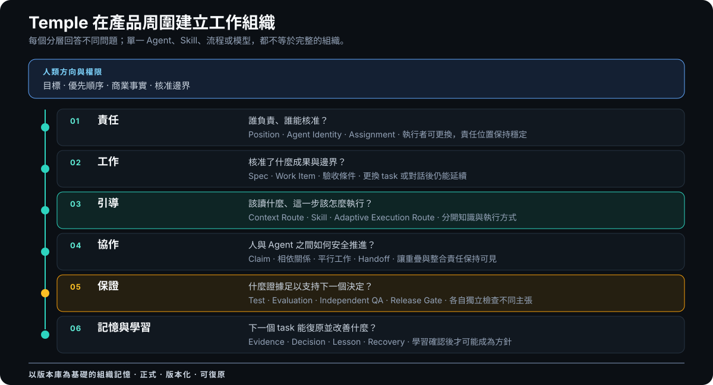
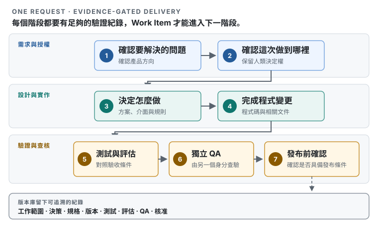

<h1 align="center">Temple</h1>

<p align="center"><strong>AI 開發組織框架</strong></p>

<p align="center">讓每一項變更都有負責者、做法與驗證依據。</p>

<p align="center"><a href="README.md">English</a> · <a href="README.ja.md">日本語</a> · <strong>繁體中文</strong></p>

<p align="center">
  <a href="https://github.com/zsz1210/temple-ai-dev-org/actions/workflows/ci.yml"></a>
  &nbsp;·&nbsp; Early Alpha
  &nbsp;·&nbsp; Node.js 24 以上
  &nbsp;·&nbsp; <a href="LICENSE">MIT</a>
</p>

---

## AI 讓實作變快了，但協作沒有因此變簡單。

AI 可以規劃、寫程式、測試與審查。可是當專案裡同時有多項工作、多段對話、多人或多個 AI 在行動時，真正困難的通常是組織問題：

- 這項變更由誰負責？
- 實際核准的是哪些內容？
- 哪些工作可以安全地同時進行？
- 測試的是哪一個版本？
- 下一位接手者該讀什麼，又可以忽略什麼？
- 這次的教訓能不能重用，還是只適用於當時的情況？

Temple 把一套能長期使用的開發組織放進專案版本庫。責任、工作狀態、所需資料、工程方法、交接、驗證紀錄與學習內容不再只存在對話裡，因此換一個人或 AI 接手時，不必重新拼湊舊聊天紀錄。

Temple 不是應用程式框架、任務追蹤工具，也不是會自行發號施令的管理者。專案原本的架構、技術、文件與工具都可以保留；Temple 管理的是人與 AI 要怎麼圍繞這些內容一起工作。

> **產品要怎麼做，由你的專案決定；工作如何分配、驗證與留下紀錄，則由 Temple 協助整理。**

## Temple Concept Layers

<picture>
  <source media="(max-width: 640px)" srcset="docs/assets/temple-layers-mobile.zh-TW.svg">
  
</picture>

Temple 是一套分層的運作模式，不是一段巨大的 prompt，也不是一個全權自主的 Agent。人類方向位於最上層，版本庫中可長期保存的狀態則是底層基礎；中間各層把責任、核准的工作、方法、協作、驗證與學習連接起來，同時避免把它們混成同一件事。

引導層刻意保留兩種不同的路由。**Context Routing** 回答目前的 Position 與步驟該讀什麼；**Adaptive Execution Routing** 則依據 Task Shape、所需能力、限制與專案方針，回答這個有邊界的步驟該怎麼執行。目前的 Alpha 只會產生可解釋的建議設定，不會啟動 Provider，也不會在背後自行切換模型。詳情請看[系統架構（英文）](docs/concepts/architecture.md#three-routes-three-decisions)與[模型路由指南（英文）](docs/getting-started/model-routing.md)。

## Temple 為專案補上什麼

- **穩定的職責：** Position 定義長期存在的責任與權限，不會綁死在某一個人或 AI 身上。
- **有邊界的工作：** 每項變更都成為 Work Item，清楚記錄範圍、相依關係、驗收條件與狀態。
- **只提供需要的資料：** Context Routing 依照目前的 Position 與步驟，把規格、決策、Skill 與驗證紀錄導向正確的執行者。
- **能解釋的執行選擇：** Adaptive Execution Routing 依據步驟所需能力，挑出符合條件且由專案管理的 execution profile；不會把 Position 綁死在特定模型上。
- **有證據才能前進：** 實作、評估、Independent QA 與發布準備是不同結論，不能互相取代。
- **安全的平行開發：** 互不依賴的工作可以同時進行；可能互相影響的工作，必須先協調並指定整合負責者。
- **經得起驗證的學習：** Lesson 會先被重新驗證，再由人決定是否升級成 Practice 或 Skill，不會因為一次成功就自動變成規則。

這些約定都和程式碼放在一起。Jira、GitHub Projects、Figma、既有規格與公司文件仍然可以管理它們原本負責的資訊，不必全部轉換成 Temple 格式。

## 一項 Work Item 如何通過 Temple

<picture>
  <source media="(max-width: 640px)" srcset="docs/assets/temple-delivery-path.zh-TW-mobile.svg">
  
</picture>

Work Item 只有在下一階段需要的依據都準備好之後，才會繼續前進。Workflow Profile 與風險會決定需要多深的獨立審查與發布準備。Temple 會在每個階段分別解析負責的 Position、所需 Context，以及符合條件的 Execution Route。

這些階段描述的是責任，不是固定職稱。Temple 目前提供的是核心開發 Position；自訂 Position 與 Workflow 仍在規劃中。未來不同領域可以改由其他 Position 負責，而不必更換整套運作模型。

## 從一個專案開始

開始前請準備 Git、Node.js 24 以上版本、Codex，以及要導入 Temple 的專案目錄。目前 CI 以 Node.js 24 為基準。

以下的 AI 引導式安裝會使用原始碼 checkout，讓 Codex 能讀到 Temple 版本庫裡的 Skills：

```bash
git clone https://github.com/zsz1210/temple-ai-dev-org.git
cd temple-ai-dev-org
npm ci
npm run verify
npm link
```

公開 Alpha 的 CLI 也可以用 `npm install --global @zsz1210/temple-ai-dev-org@next` 安裝。第一次需要 AI 引導或想參與貢獻時，仍建議使用原始碼；npm 指令只會安裝 CLI，不會預先把 `$temple-init` Skill 的內容交給尚未初始化的專案。

在 Codex 裡開啟 Temple，然後提出：

> 使用 [`$temple-init`](docs/getting-started/core-skills.md#temple-init) 初始化 `/absolute/path/to/my-project`。請先檢查專案現有的分支、審查與整合規範；若資料不足，只詢問會影響執行的部分。接著提議 Agent Identity 的英文名字與整合方式摘要，等我確認後再寫入檔案。

專案原本採用的 GitHub、GitLab 或公司開發流程仍然具有最終效力。Temple 只記錄 AI 執行工作時需要的流程摘要，不會強制改用 GitHub Flow，也不會變更代管平台的設定。

完成初始化後，先從一個範圍明確的成果開始：

> 使用 [`$decision-interview`](docs/getting-started/core-skills.md#decision-interview) 釐清這項變更，再使用 [`$temple-work`](docs/getting-started/core-skills.md#temple-work) 建立最小且能被獨立驗證的 Work Item。

你可以在本機檢查建立後的組織狀態：

```bash
node ./templew.mjs doctor .
node ./templew.mjs status .
node ./templew.mjs observe .
```

Temple 會安裝到每個產品專案裡；不必為每個產品各自 fork 一份框架。

本版本庫根目錄的 `.ai-org/` 是 Temple 自己的開發紀錄。讀者可以直接查核它的範圍、交接、評估與審查，不必只相信框架的自我介紹。Temple 將這種作法稱為 **Auditable Self-Hosting**。由專案管理的 **Evidence Profile** 會把值得公開的治理依據，和認證資訊、原始執行資料、即時帳號狀態、本機專屬資訊分開。這份紀錄不會進入 npm 套件，也不會被複製到其他專案。詳細規則請參考 [Auditable Self-Hosting and Evidence Profiles（英文）](docs/operations/auditable-self-hosting.md)。

## 同一套運作模式，可以用在不同規模

- **Solo** — 由一個人主導 AI 輔助開發。少數 Agent Identity 可以兼任多個 Position，但 Developer 與 Independent QA 必須分開。
- **Collaborative** — 多位成員各自使用 AI。專案會明確記錄人類授權、可承接工作的成員、共享資源、claim 與整合責任。
- **High-Assurance** — 適用於失敗會帶來較高營運或商業影響的工作。Temple 會依照風險增加驗證要求、身分分離、復原準備與不同人類的核准。

無論規模多大，核心概念都不變。團隊只在風險真的需要時增加分離與驗證，不必換掉整套工作方式。

## 可以擴充工作方法，但不能繞過權限

Temple Skill 是可以重用的工程方法，能協助產品探索、領域建模、UI、實作、測試、審查、文件整理，或其他範圍清楚的工作。每個專案也能加入自己的 Skill，並把它和程式碼放在一起維護。

Skill 不會授予權限、核准依賴套件，也不能跳過交付階段。記錄一項 Lesson，也不代表它立刻成為整個專案的規則。Temple 將觀察、重新驗證、刻意升級與權限分開，讓組織可以學習，又不會把每次成功都變成永久政策。

進一步請參考[能力目錄（英文）](docs/extensions/capability-catalog.md)、[Skill 建立指南（英文）](docs/extensions/skill-authoring.md)與[工程學習流程（英文）](docs/extensions/engineering-learning.md)。

## 目前的成熟度

Temple 目前是 **Early Alpha**，適合在有人監督的情況下，用於低風險的本機專案與範圍明確的試行。

- **現在可以使用：** 以版本庫為核心的 Solo 流程、穩定的 Position、Work Item、可重現的資料與 Capability 導引、可解釋且不會直接執行 Provider 的 Adaptive Execution Routing、受到管理的 Skill 與學習、生命週期證據、Auditable Self-Hosting Profile、本機狀態以及升級界線。
- **仍屬實驗或有限驗證：** Collaborative 與 High-Assurance 契約、平行開發規劃、Provider 觀測與校準、本機 Control Plane、外部追蹤工具協調，以及逐 Work Item 的使用量歸屬。
- **尚未宣稱完成：** 大型多人與多台電腦的充分驗證、正式環境監測或修復、無人值守的外部寫入、自動模型路由、受法規管制環境的驗收，以及對所有專案都成立的時間或 Token 節省數據。

Temple 會保留尚未解決的驗證缺口，不會把一次本機測試通過包裝成企業級證明。

## 接下來可以閱讀

- [使用指南（英文）](docs/getting-started/usage.md) — 導入、運作、升級與疑難排解。
- [Temple 術語表（英文）](docs/concepts/terminology.md) — Position、Agent Identity、Work Item、Evidence 與運作模式。
- [系統架構（英文）](docs/concepts/architecture.md) — 版本庫界線與正式狀態。
- [文件導覽（英文）](docs/README.md) — 多人協作、UI 模式、外部追蹤、品質保證、學習、驗證與決策。
- [參與貢獻（英文）](CONTRIBUTING.md)、[行為準則（英文）](CODE_OF_CONDUCT.md)與[安全回報方式（英文）](SECURITY.md) — 說明如何參與，以及遇到行為事件或安全問題時該從哪個非公開管道聯絡。

## 最終決定仍由人類負責

Temple 可以協調工作並保存驗證依據，但不會自行決定商業事實、優先順序、認證資訊、支出、不可逆的外部操作、正式環境修復或高風險核准。

## 授權條款

[MIT](LICENSE)。第三方來源與採用界線記錄在 [THIRD_PARTY_NOTICES.md](THIRD_PARTY_NOTICES.md)。
