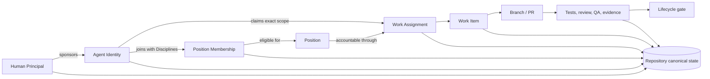
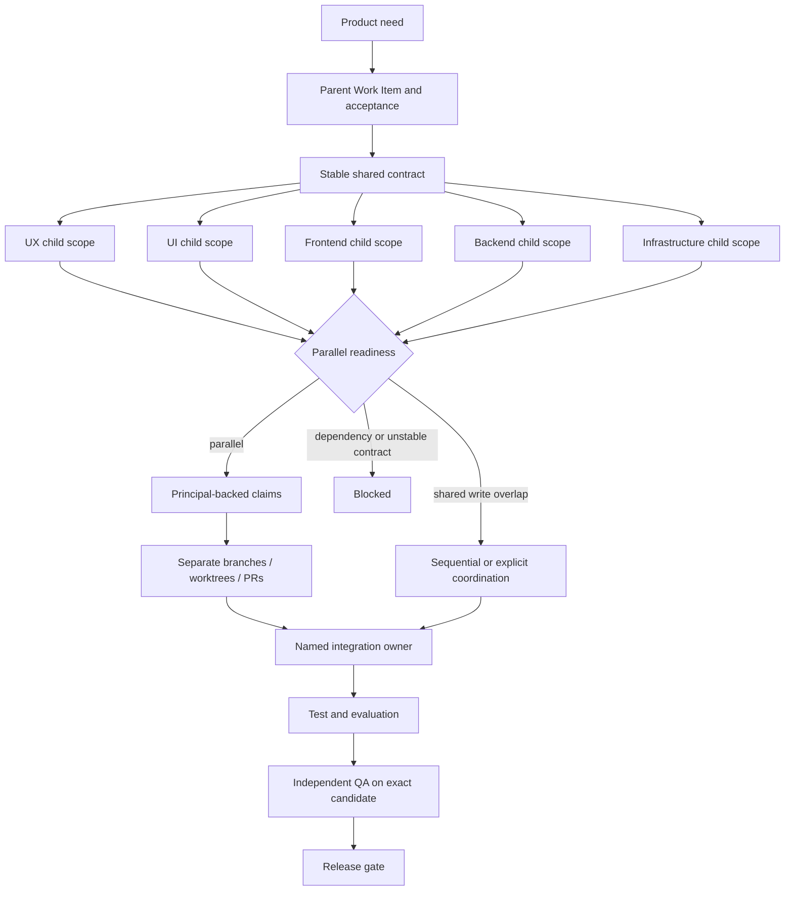

# Collaborative development model

Temple's Collaborative profile lets several people use their own AI Agents in one product repository without turning chat history into shared truth. It adds identity, eligibility, assignment, concurrency, and evidence records around the existing Position workflow. It does not replace GitHub permissions, pull-request review, CI, or human management.

## The operating model



The terms are deliberately separate:

- **Human Principal** is the accountable person operating or supervising an Agent Identity.
- **Agent Identity** is the durable project identity of an AI participant. It is not a Codex task and does not disappear when a conversation closes.
- **Position** defines responsibility and authority, such as Developer, UI Designer, or Independent QA.
- **Discipline** describes technical capability inside a Position, such as frontend, backend, full-stack, infrastructure, mobile, UI, or UX.
- **Position Membership** makes an Agent eligible to work in a Position with declared Disciplines. Several Agents may belong to the same Position pool.
- **Assignment** in `assignments.json` remains the single default owner for backward compatibility. A claim may select another eligible pool member for one Work Item.
- **Codex task record** is the observable Agent Session: thread identity, host, revision, status, and work-item link.
- **Work claim** records the selected Principal, Agent, base revision, branch, optional worktree, and timestamps for one bounded Work Item.

## Profiles are governance intensity, not team size

| Profile | Intended use | Current status |
|---|---|---|
| Solo | One person operates the organization with lightweight repository coordination | Stable alpha path |
| Collaborative | Several people sponsor Agent Identities, use Position pools, and claim isolated work | Foundation implemented; large-scale validation pending |
| High-Assurance | Risk-driven approvals, stronger separation of duties, and externally verified audit evidence | Reserved in the profile catalog; not selectable yet |

A company with five engineers may still use Solo for a low-risk experiment. One developer may choose Collaborative when several independent Agents need explicit scope isolation. Select the profile from coordination risk, not headcount alone.

## From feature to parallel work



A work item is parallel-ready only when all readiness checks pass:

1. scope and acceptance criteria are explicit;
2. an eligible owner is available;
3. the base revision and affected paths are recorded;
4. dependencies are terminal;
5. any shared contract is stable;
6. affected-path overlap is absent or has an explicit coordination record;
7. an integration owner is named;
8. unresolved items are cleared; and
9. the selected Agent's Position Membership covers every required Discipline.

`temple parallel check` returns `parallel`, `sequential`, or `blocked` guidance with individual pass/fail checks. Declaring `parallel` through `work-item configure` is rejected if any check fails. The result is a coordination gate, not proof that two changes are semantically independent.

## Company team examples

Frontend, backend, full-stack, and infrastructure engineers normally join the Developer Position with different Disciplines. A full-stack Agent may have both `frontend` and `backend`; a backend specialist may have only `backend`. UI Designer and UX Designer remain separate Positions because their responsibilities, outputs, and approval questions differ from implementation.

If several backend engineers participate, give each one a distinct Agent Identity and Developer membership. The Engineering Manager decomposes the parent feature into bounded child Work Items. Each Work Item declares the required Disciplines, affected paths, dependencies, shared-contract status, and integration owner. An eligible Agent then claims it under its Human Principal. This keeps technical specialization flexible without inventing a new Position for every technology.

## Repository and GitHub responsibilities

Temple owns repository-readable organizational state: Principals, sponsorships, membership eligibility, Work Items, claims, Context Capsules, handoffs, and evidence pointers. GitHub remains authoritative for repository access, branch protection or rulesets, CODEOWNERS, pull-request approval, checks, merge queue, and the final merged commit.

Repository mutations use a short-lived local lock. That protects processes using the same checkout, not separate machines. Cross-machine safety therefore depends on collision-resistant Collaborative Work Item IDs, one work-item file per claim, normal Git conflict handling, protected branches, and pull-request review. A future remote coordination backend may strengthen this boundary; the current release does not claim distributed locking.

## Configure a collaborative project

```bash
temple collaboration add-principal . \
  --principal-id principal-alice \
  --name "Alice Morgan"

temple collaboration add-agent . \
  --agent-id agent-taylor \
  --name "Taylor Brooks"

temple collaboration sponsor . \
  --principal-id principal-alice \
  --agent-id agent-taylor

temple collaboration add-membership . \
  --agent-id agent-taylor \
  --position developer \
  --discipline backend

temple collaboration set-profile . --profile collaborative
temple doctor .
temple status .
```

Create and configure bounded work before claiming it:

```bash
temple work-item create . \
  --title "Implement checkout totals" \
  --scope "Checkout total API and tests" \
  --acceptance "Independent QA reproduces the total" \
  --affected-path "src/checkout" \
  --discipline backend \
  --base-revision abc123 \
  --integration-owner agent-taylor

# Complete the normal Spec and Design gates, then move the item to Build.
temple transition . --work-item WI-YYYYMMDD-RANDOM --to spec --satisfy work_order=docs/work-order.md
temple transition . --work-item WI-YYYYMMDD-RANDOM --to design --satisfy approved_scope=docs/spec.md --satisfy acceptance_criteria=docs/spec.md
temple transition . --work-item WI-YYYYMMDD-RANDOM --to build --satisfy technical_design=docs/design.md --satisfy risk_review=docs/design.md

temple work-item configure . \
  --work-item WI-YYYYMMDD-RANDOM \
  --agent-id agent-taylor \
  --contract-status stable \
  --shared-contract-ref docs/checkout-api.md \
  --parallel-mode parallel

temple work-item claim . \
  --work-item WI-YYYYMMDD-RANDOM \
  --agent-id agent-taylor \
  --principal-id principal-alice \
  --base-revision abc123 \
  --branch alice/checkout-totals \
  --worktree /absolute/path/to/worktree
```

Do not copy placeholder IDs, revisions, or evidence paths literally. The created Work Item prints its generated ID. The selected Agent must be a member of the Work Item's current owner Position, so a Developer claim occurs after the lifecycle reaches Build. Release the claim at handoff, abandonment, or completion so status does not imply active ownership.

## Current evidence boundary

Automated tests prove local initialization, migration, model validation, readiness checks, overlap detection, pooled membership, claims, task registration, release, and status projection. They do not prove multi-human behavior on several machines under real Git and pull-request contention. The retained [large-scale collaborative test plan](validation/collaborative-large-scale-test-plan.md) is an explicit release-evidence gap and remains `not_run`.
