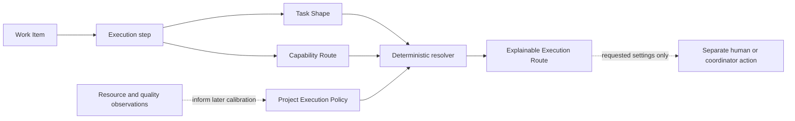

# Adaptive execution routing

Temple separates **who is responsible** from **how one step should execute**.

A Position owns responsibility and authority. An Execution Route describes a suitable execution profile for one bounded step. The same Developer may therefore use a fast profile for a mechanical edit, a balanced profile for implementation, and a deeper profile for a security-sensitive design review without changing Position or Agent Identity.

## The model

The solid path is implemented locally and deterministically. The final dotted path is deliberately outside the resolver: Temple does not contact a Provider, start a task, or change a model when it resolves a route.

## Six distinct concepts

| Concept | Answers | Must not be confused with |
|---|---|---|
| Position | Who owns the responsibility and authority? | Model choice |
| Task Shape | What kind of work is this step, at what stage and risk? | Agent name or prompt text |
| Capability Route | What capabilities and modalities are required or optional? | Permission to use a tool or service |
| Execution Profile | Which project-approved candidate can satisfy those constraints? | A universal best model |
| Execution Route | Which eligible profile did the deterministic policy resolve, and why? | A Provider acknowledgement or task launch |
| Model Calibration | What matched evidence may improve future preference ordering? | Permission to execute automatically |

## One Work Item, several execution steps

Routing happens per step, not once for an entire Work Item. A feature can contain, for example:

1. a high-risk architecture step requiring deep reasoning;
2. a standard implementation step requiring code modification;
3. an independent evaluation step requiring a different responsibility and quality capability; and
4. a documentation step that can use a lighter profile.

All steps remain inside the same Work Item lifecycle. An Execution Step does not create a second lifecycle, change the Work Item owner, or satisfy a delivery gate.

## Hard constraints before preference

The resolver rejects ineligible profiles before considering which one is preferred. It checks:

1. profile activation;
2. required capabilities;
3. required modalities;
4. Provider allowlist;
5. data class;
6. execution boundary;
7. risk class; and
8. typed resource limits.

Unknown required capabilities fail closed. Unknown optional capabilities remain visible in the result but do not block an otherwise eligible route. After filtering, the resolver uses the first matching rule's explicit preference order and then the configured fallback only when that fallback is itself eligible.

## Selection modes

| Mode | Meaning | Execution authority |
|---|---|---|
| `pinned` | Resolve exactly the named profile or fail closed. | None |
| `shadow` | Show what policy would select for diagnosis and comparison. | None |
| `advisory` | Return a recommendation that a human or coordinator may apply separately. | None |

`automatic` is intentionally unsupported. Every route result states that automatic execution, Provider contact, and mutation did not occur.

## Provider-neutral framework, project-owned mapping

Temple ships model classes and reasoning classes without assuming a Provider. The initialized `.ai-org/project/execution-policy.json` belongs to the project and may map profiles to concrete Provider, model, and reasoning values. A mapping must provide all three values together or leave all three unknown.

This keeps the framework reusable while allowing one project to map profiles to GPT-5.6 models, another to use a local model, and a media project to add a rendering pipeline. Adding a capability or execution profile does not create a Position or expand anyone's authority.

## Resources beyond Tokens

Execution routing uses typed resource measures. The initial vocabulary includes Tokens, latency, retries, Credits, GPU time, image count and pixels, video and audio duration, and human editing time. Projects can add namespaced measures with an explicit unit and aggregation rule.

Missing data is not zero. An unavailable observation remains `null` with a source and quality label, so later analysis can distinguish inexpensive work from unobserved work.

## Relationship to the rest of Temple

- [Capability catalog](../extensions/capability-catalog.md) explains available reusable methods; a Capability Route selects required capability IDs for one step.
- [Workflow profiles](workflow-profiles.md) scale delivery gates for the Work Item; an Execution Profile configures one execution candidate.
- [Token Efficiency and Model Routing](../operations/token-efficiency-and-model-routing.md) owns usage observation and matched calibration; it does not launch the route.
- [Execution routing operations](../operations/execution-routing.md) documents the project policy, request format, resolver command, and interpretation rules.
- [ADR-0046](../adr/0046-separate-adaptive-execution-routing.md) records why this layer is separate.
