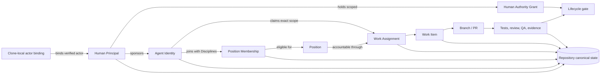
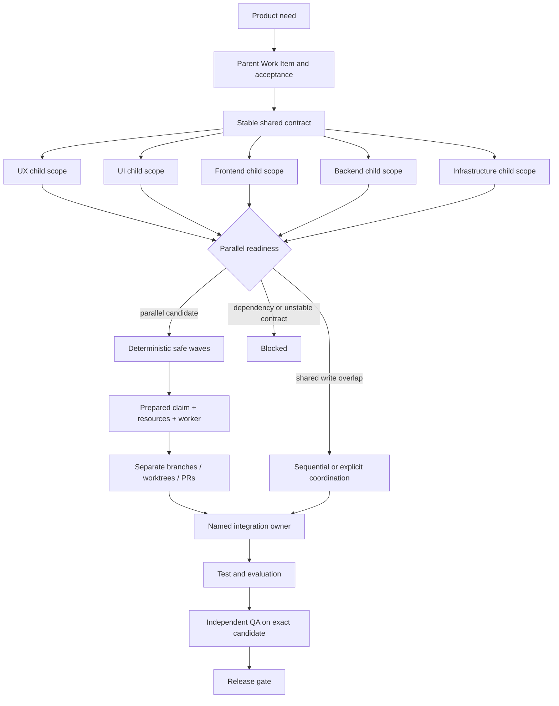

# Collaborative development model

Temple's Collaborative profile lets several people use their own AI Agents in one product repository without turning chat history into shared truth. It adds identity, eligibility, assignment, concurrency, and evidence records around the existing Position workflow. It does not replace GitHub permissions, pull-request review, CI, or human management.

## The operating model



The terms are deliberately separate:

- **Human Principal** is an immutable, project-scoped accountable-person ID. Display names may repeat; names and email addresses are not identity keys. Personnel changes suspend or deactivate the record instead of deleting or reusing it.
- **Local Actor Binding** binds one Git clone to a Human Principal without committing credentials or the binding. It lives under the Git common directory at `.git/temple/identity.json`; Solo may be self-asserted, while Collaborative and High-Assurance require externally supplied evidence.
- **Agent Identity** is the durable project identity of an AI participant. It is not a Codex task and does not disappear when a conversation closes.
- **Position** defines responsibility and authority, such as Developer, UI Designer, or Independent QA.
- **Discipline** describes technical capability inside a Position, such as frontend, backend, full-stack, infrastructure, mobile, UI, or UX.
- **Position Membership** makes an Agent eligible to work in a Position with declared Disciplines. Non-default memberships start `provisional` and need qualification evidence before activation. Membership can later be suspended, expired, or revoked without deleting history.
- **Assignment** in `assignments.json` remains the single default owner for backward compatibility. A claim may select another eligible pool member for one Work Item.
- **Human Authority Grant** is a scoped, risk-bounded, optionally expiring grant to a Human Principal. It is separate from Position membership and Agent capability.
- **Bootstrap Owner** is a temporary setup authority for the first Human Principal. Retiring it requires two active authority holders and a ready recovery configuration; it is not a permanent backdoor.
- **Runtime worker** is the execution reservation tied to a plan, claim, and optional scarce resources. It is either an internal subagent or a separate user-owned Codex task.
- **Codex task record** exists only for a separate task visible to the user: thread identity, host, revision, status, work-item link, and runtime-worker correlation. An internal subagent never enters this registry.
- **Work claim** records the selected Principal, Agent, base revision, branch, optional worktree, and timestamps for one bounded Work Item.

## Profiles are governance intensity, not team size

| Profile | Intended use | Current status |
|---|---|---|
| Solo | One person operates the organization with lightweight repository coordination | Stable alpha path |
| Collaborative | Several people sponsor Agent Identities, use Position pools, and claim isolated work | Operational contract implemented; Real Collaborative validation remains `not_run` |
| High-Assurance | Risk-driven evidence, rollback, human approvals, and stronger separation of duties | Selectable after its human-accountability prerequisites pass; representative-pilot and High-Assurance drills remain separate gates |

A company with five engineers may still use Solo for a low-risk experiment. One developer may choose Collaborative when several independent Agents need explicit scope isolation. Select the profile from coordination risk, not headcount alone.

High-Assurance retains the same ten Positions. It requires at least two active Human Principals, a sponsor for every active Agent Identity, Developer separation from Independent QA and Release Manager, and a risk tier on every new Work Item. The tier scales artifact depth, allowed UI modes, exact-revision evidence, rollback depth, and distinct human approvals. See [High-Assurance profile](high-assurance.md).

## From feature to parallel work



A work item is parallel-ready only when all readiness checks pass:

1. scope and acceptance criteria are explicit;
2. an eligible owner is available;
3. the base revision and affected paths are recorded;
4. dependencies are terminal for an individual check, or selected for an earlier group wave;
5. any shared contract is stable;
6. affected-path overlap is absent or has an explicit coordination record naming the conflicting Work Item ID;
7. an integration owner is named;
8. unresolved items are cleared; and
9. the selected Agent's Position Membership covers every Discipline required by the current lifecycle stage; and
10. every stage-specific shared resource is defined and has enough available capacity.

`parallel check` returns `parallel`, `sequential`, or `blocked` guidance with individual pass/fail checks. Declaring `parallel` through `work-item configure` is rejected if any check fails. `parallel plan` evaluates a group, moves selected dependencies into later waves, separates unresolved path or resource-capacity conflicts, and applies an optional worker limit. The results are coordination gates, not proof that two changes are semantically independent.

## Safe waves and runtime dispatch

A generated plan is a rebuildable projection, not execution authority. It contains plan-only manifests with Work Item, Position, Agent, base revision, paths, dependencies, active stage requirements, Integration Owner, suggested task title, bounded context command, and preparation fingerprint. Planning creates no Codex task, claim, or external action.

When implementation is already authorized, `parallel prepare` atomically records an eligible Principal-backed claim, required shared-resource reservations, and a runtime-worker reservation before any runtime is created. The Agent runtime then dispatches the prepared first wave up to capacity without asking again merely because the work can run in parallel. If concurrency is unavailable, it preserves the wave boundary and executes sequentially. Internal subagents attach a runtime ID; only separate user-owned tasks are registered with a real thread ID.

The Integration Owner joins exact candidate revisions, verification, and unresolved items before dependent work or lifecycle advancement. The join changes canonical state, so the runtime rebuilds the plan before using another wave. Exact overlap IDs are required for individual readiness; both overlapping Work Items must name each other before group planning can place them in the same wave. See [Parallel orchestration](parallel-orchestration.md).

## Company team examples

Frontend, backend, full-stack, and infrastructure engineers normally join the Developer Position with different Disciplines. A full-stack Agent may have both `frontend` and `backend`; a backend specialist may have only `backend`. UI Designer and UX Designer remain separate Positions because their responsibilities, outputs, and approval questions differ from implementation.

If several backend engineers participate, give each one a distinct Agent Identity and Developer membership. The Engineering Manager decomposes the parent feature into bounded child Work Items. Each Work Item declares stage-specific Disciplines and shared resources, affected paths, dependencies, shared-contract status, and integration owner. Preparation then claims it through an eligible Agent and Human Principal before a runtime begins. This keeps technical specialization flexible without inventing a new Position for every technology.

## Repository and GitHub responsibilities

Temple owns repository-readable organizational state: Principals, sponsorships, membership eligibility, Work Items, claims, Context Capsules, handoffs, and evidence pointers. GitHub remains authoritative for repository access, branch protection or rulesets, CODEOWNERS, pull-request approval, checks, merge queue, and the final merged commit.

Repository mutations use a short-lived local lock. That protects processes using the same checkout, not separate machines. Cross-machine safety therefore depends on collision-resistant Collaborative Work Item IDs, one work-item file per claim, normal Git conflict handling, protected branches, and pull-request review. Conflicting writes are expected to become visible Git conflicts or rejected non-fast-forward pushes; Temple does not claim a distributed lock or silently elect a winner.

The Team dashboard is a read-only organizational view with three surfaces: **Responsibilities**, **People & Agents**, and **Authority**. It deliberately does not draw Human Principals as a reporting apex. The private network viewer exposes aggregate governance readiness but redacts Principal records, sponsorships, grant holders and scopes, recovery trustees, and every clone-local actor binding.

When the company plans work in Jira, GitHub, or another tracker, map the team-visible parent outcome rather than mirroring every AI child. Frontend, backend, infrastructure, UI, UX, evaluation, and QA child Work Items can remain internal while inheriting the parent reference for context. Expose a child only when another human or team must coordinate it. The external board does not replace claims, affected-path checks, shared-contract readiness, lifecycle evidence, or Independent QA. See [Task and external tracker coordination](task-and-tracker-coordination.md).

## Configure a collaborative project

```bash
node ./templew.mjs collaboration migrate .

node ./templew.mjs collaboration add-principal . \
  --principal-id principal-alice \
  --name "Alice Morgan"

node ./templew.mjs collaboration add-agent . \
  --agent-id agent-taylor \
  --name "Taylor Brooks"

node ./templew.mjs collaboration sponsor . \
  --principal-id principal-alice \
  --agent-id agent-taylor

node ./templew.mjs collaboration add-membership . \
  --agent-id agent-taylor \
  --position developer \
  --discipline backend

node ./templew.mjs collaboration qualify-membership . \
  --agent-id agent-taylor \
  --position developer \
  --status active \
  --evidence docs/qualifications/taylor-backend.md \
  --risk-tier standard

node ./templew.mjs collaboration set-profile . --profile collaborative

# Run in each collaborator's clone. This file is stored under the Git common
# directory and is not added to the repository.
node ./templew.mjs collaboration bind-identity . \
  --principal-id principal-alice \
  --verification-class external-evidence \
  --provider-id github \
  --provider-subject 12345678 \
  --provider-handle alice \
  --evidence-ref github:organization-membership-review

node ./templew.mjs doctor .
node ./templew.mjs status .
```

Migration never guesses a Bootstrap Owner. If v1 already contained Principals, establish the temporary owner explicitly; teams with at least two active Principals need two distinct approvals:

```bash
node ./templew.mjs collaboration establish-bootstrap . \
  --principal-id principal-alice \
  --approved-by principal-alice \
  --approved-by principal-casey
```

Provider subjects are opaque stable IDs supplied by the provider or organization, not email addresses. Temple records evidence references but does not authenticate GitHub or another identity provider itself. Keep email, tokens, session data, and credentials out of `collaboration.json`.

Authority expansion is explicit. While the Bootstrap Owner is active, that Principal must approve new grants. After bootstrap retirement, authority changes require two distinct active grant holders. Recovery trustees and threshold are project configuration; Temple does not hardcode a particular team size or a fixed `2-of-3` policy.

Create and configure bounded work before claiming it:

```bash
node ./templew.mjs work-item create . \
  --title "Implement checkout totals" \
  --scope "Checkout total API and tests" \
  --acceptance "Independent QA reproduces the total" \
  --affected-path "src/checkout" \
  --discipline backend \
  --stage-discipline test=quality \
  --base-revision abc123 \
  --integration-owner agent-taylor

# Complete the normal Spec and Design gates, then move the item to Build.
node ./templew.mjs transition . --work-item WI-YYYYMMDD-RANDOM --to spec --satisfy work_order=docs/work-order.md
node ./templew.mjs transition . --work-item WI-YYYYMMDD-RANDOM --to design --satisfy approved_scope=docs/spec.md --satisfy acceptance_criteria=docs/spec.md
node ./templew.mjs transition . --work-item WI-YYYYMMDD-RANDOM --to build --satisfy technical_design=docs/design.md --satisfy risk_review=docs/design.md

node ./templew.mjs work-item configure . \
  --work-item WI-YYYYMMDD-RANDOM \
  --agent-id agent-taylor \
  --contract-status stable \
  --shared-contract-ref docs/checkout-api.md \
  --parallel-mode parallel

node ./templew.mjs parallel plan . \
  --parent WI-YYYYMMDD-1111111111 \
  --max-workers 3

node ./templew.mjs parallel prepare . \
  --work-item WI-YYYYMMDD-RANDOM \
  --agent-id agent-taylor \
  --principal-id principal-alice \
  --base-revision abc123 \
  --branch alice/checkout-totals \
  --worktree /absolute/path/to/worktree \
  --runtime-kind user-task
```

Do not copy placeholder IDs, revisions, or evidence paths literally. The created Work Item prints its generated ID. The selected Agent must be a member of the Work Item's current owner Position, so Developer preparation occurs after the lifecycle reaches Build and only for a Work Item in the stored first wave. After creating a separate Codex task, attach it with `task register --worker-id <reserved-worker-id>`. Release the claim at handoff, abandonment, or completion so status does not imply active ownership.

## Current evidence boundary

Validation is a ladder, not one boolean: `automated`, `simulated_collaborative`, `real_collaborative`, `representative_pilot`, and `high_assurance_drill`. A lower gate never satisfies a higher one. Automated and disposable-clone simulations can prove local initialization, migration, qualification, authority invariants, Git-conflict visibility, recovery, projections, and exact-revision behavior. They do not prove several real people operating independently administered environments or external-auditor acceptance. The retained [Real Collaborative test plan](../validation/collaborative-large-scale-test-plan.md) is an explicit evidence gap and remains `not_run` until that exact gate is performed.
