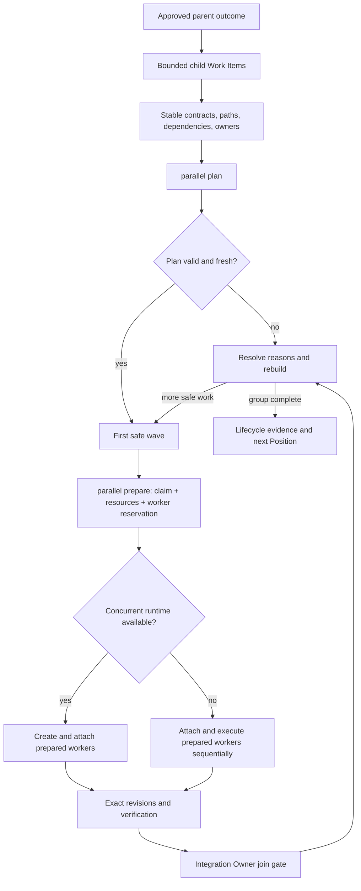

# Parallel orchestration

Parallel work is useful only when the organization can explain why the work is independent, who may perform it, what must be joined, and when the plan is no longer current. Temple therefore separates three concerns:

1. the Engineering Manager decomposes product work into bounded canonical Work Items;
2. the CLI derives a deterministic, rebuildable dispatch plan; and
3. the CLI prepares an authorized claim and declared resource capacity before an Agent runtime creates and runs an actual worker.

Planning does not invent product tasks, create Codex tasks, claim Work Items, or perform external actions. The separate `parallel prepare` mutation claims only an already planned first-wave Work Item and records its runtime reservation; it still does not create the runtime or authorize new scope.

## Responsibility model

| Responsibility | Owner |
|---|---|
| Define the parent outcome, acceptance, and child boundaries | Engineering Manager with the responsible product and technical Positions |
| Stabilize product, UI, API, and shared technical contracts | Product Manager, UI/UX Positions, and Tech Lead according to subject authority |
| Record dependencies, affected paths, stage Disciplines and resources, base revision, eligible Agent, and Integration Owner | Engineering Manager |
| Derive safe waves and plan-only dispatch manifests | `node ./templew.mjs parallel plan` |
| Atomically record claim, shared-resource reservations, and runtime-worker reservation | `node ./templew.mjs parallel prepare` with the eligible Agent and Human Principal |
| Create the runtime and attach its internal runtime ID or separate user-task ID | Authorized Agent runtime |
| Join candidate revisions, verification, and unresolved items | Named Integration Owner |
| Report invalid or stale plans | Observer through status, doctor, and Context Capsules |
| Independently reproduce the joined candidate | Independent QA |

## Flow



## Build a plan

Plan every active non-terminal Work Item:

```bash
node ./templew.mjs parallel plan .
```

Plan all non-terminal descendants of one parent:

```bash
node ./templew.mjs parallel plan . --parent WI-0001
```

Limit each wave when the runtime or team has a known capacity:

```bash
node ./templew.mjs parallel plan . --parent WI-0001 --max-workers 3
```

Omitting `--max-workers` adds no artificial CLI limit; the runtime still dispatches only up to its actual capacity. `--no-write` previews the result without creating `.ai-org/views/parallel-plan.json` or rebuilding status. JSON output is available with `--json`.

The parent selector includes recursive descendants and excludes the parent itself. Without a parent selector, planning considers all active Work Items so an apparently independent group cannot ignore a conflicting active write elsewhere in the repository.

## Classification and wave construction

The planner reads all Work Items plus collaboration, Assignment, Agent, workflow, specification authority, and project-owned shared-resource state. It then classifies each selected item:

- **dispatchable:** preparation and authority checks pass, non-terminal dependencies can be scheduled in an earlier wave, and conflicts can be separated safely;
- **active:** an existing claim already represents execution ownership;
- **sequential:** preparation is incomplete or the Work Item explicitly requests sequential work;
- **blocked:** a dependency is outside the selected group or unavailable, a contract is unstable, unresolved items remain, the specification is stale or unapproved, the dependency graph is cyclic, or the Work Item explicitly requests blocked mode.

`sequential` is not a failure. It is an explicit decision to preserve correctness when concurrency would not help or the parallel contract is incomplete.

The planner uses a stable Work Item ordering. A Work Item enters a wave only when every dependency is terminal or appears in an earlier wave. Unresolved affected-path conflicts never share a wave. Stage-specific resource requirements that exceed declared capacity also enter separate waves. `--max-workers` may defer otherwise independent items to later waves. These rules make repeated planning deterministic for the same canonical state.

`temple parallel check` remains the single-item gate and requires current dependencies to be terminal. Group planning may instead place a selected dependency in an earlier wave.

## Overlap resolution

An overlap record must name the exact conflicting Work Item ID. Generic text such as "the overlap was reviewed" does not satisfy the gate.

For two path-overlapping items to share one wave, both Work Items must name the other ID in `overlap_resolution`. One-sided acknowledgement still places them in separate waves. This record states that both scopes were intentionally coordinated; it does not prove semantic independence, so the responsible Positions must still review the actual change surfaces.

An unclaimed ancestor used only to coordinate a decomposed outcome does not block its descendants merely because it declares the same broad path. If that ancestor has an active claim, it is execution work again and the overlap blocks the descendant plan unless explicitly coordinated.

## Dispatch manifest and runtime behavior

Every dispatch entry records:

- Work Item, Position, planned Agent, and suggested task title;
- base revision, affected paths, dependencies, active lifecycle stage, stage-specific Disciplines, and shared-resource units;
- Integration Owner;
- a bounded project-launcher context command and a preparation fingerprint; and
- explicit `false` markers for task creation, claim creation, and external action.

When the current request or Work Item already authorizes implementation, a capable runtime should prepare and dispatch the first safe wave up to available capacity without asking for a redundant parallelism confirmation. It must still respect approval, cost, sensitive-data, deployment, external-write, and irreversible-action boundaries. If concurrent task creation is unavailable, it executes the same wave sequentially rather than redefining the tasks.

Prepare every worker before creating it:

```bash
node ./templew.mjs parallel prepare . \
  --work-item WI-0001 \
  --agent-id agent-example \
  --principal-id human \
  --base-revision BASE_SHA \
  --branch work/wi-0001 \
  --runtime-kind internal-subagent
```

Preparation atomically records the Principal-backed claim, resource reservations, and a runtime-worker reservation. An internal subagent then attaches its runtime ID through `worker attach` and never enters the Codex task registry. A separate user-owned Codex task passes the reservation's worker ID to `task register` with its real thread or client-thread ID. If preparation fails, do not create the runtime.

Every entry carries a preparation fingerprint. Once the first member is prepared, the overall plan becomes stale as an observation of canonical state, but another member from the same unchanged, previously verified first wave may still be prepared. The CLI accepts that continuation only when the stored plan digest matches, the target entry fingerprint still matches current authority and requirements, readiness still passes, and declared resources remain available. Any edited plan or changed target requires replanning.

## Join gate and replanning

Every wave names one or more Integration Owners and requires three evidence classes:

1. exact candidate revisions;
2. verification results; and
3. unresolved items.

The Integration Owner checks compatibility, records the integrated candidate and remaining questions, and prevents dependent work or lifecycle advancement until the join is credible. Preparing workers, changing Work Items, updating specifications, or recording the join changes canonical state and makes the old plan stale as a complete projection. The per-entry continuation above is limited to untouched members of that already verified first wave. Rebuild the plan before dispatching another wave.

Future waves in one plan are a deterministic forecast, not permission to ignore changed state. Only the first wave of a fresh plan is an immediate dispatch candidate.

## Freshness and observability

The generated plan contains a SHA-256 source fingerprint covering all Work Items, collaboration state, Assignments, Agent Identities, workflow, specification index, and repository specification-source digests. A change to any of these inputs marks the plan stale. The conservative repository-wide Work Item scope is intentional: a new item can introduce a path conflict even when it is outside the selected parent.

- `status` reports plan freshness and disposition plus runtime-worker and shared-resource state.
- `doctor` treats an invalid or stale generated plan as a rebuildable warning while independently validating claims, workers, resources, and user-task correlation.
- `context resolve` records the selected Work Item's disposition and wave, and warns when the plan is invalid or stale.

Generated views never become lifecycle authority. Correct the canonical Work Items, collaboration state, or specifications, then rebuild the plan.

## Current boundaries

- The local mutation lock is not a distributed lock. Separate machines still require branches, pull requests, protected rules, CI, and explicit Git conflict resolution.
- Path declarations and explicit resolutions are coordination evidence, not a semantic code-merge proof.
- The CLI knows only declared resource capacity and recorded runtime-worker state; it does not discover actual available subagent slots, create runtimes, or create, rename, open, or archive Codex tasks.
- A terminal worker releases its shared resources. It does not release an attached lifecycle claim, forge a handoff, advance workflow, or certify QA. Cancelling before attachment is the only automatic claim-release case.
- Local automated tests cover deterministic waves, dependencies, overlap, capacity, multi-member preparation, rollback, correlation, staleness, context, status, doctor, init, and upgrade behavior. The retained multi-human, multi-machine validation remains `not_run`.

See [Runtime coordination and recovery](runtime-coordination.md), [Collaborative development model](collaboration.md), [Progressive context routing](context-routing.md), [ADR-0021](adr/0021-safe-group-parallel-orchestration.md), and [ADR-0022](adr/0022-recoverable-runtime-dispatch.md).
