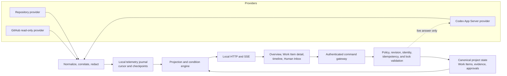

# Phase 3: Real-time control plane

- Status: Accepted design
- Design date: 2026-08-30
- Implementation status: Phase 3A delivered in Alpha.20; Phase 3B and 3C in progress
- Depends on: Phase 2A runtime coordination, Phase 2B evidence and Observer, Phase 2C extension contracts
- Research: [Phase 3 control-plane research](research/phase-3-control-plane-research.md)
- Work breakdown: [Phase 3 work items](phase-3-work-items.md)

## Outcome

Phase 3 turns the existing static Observer into a local operational surface where a human can understand active work, failures, stale evidence, and pending decisions without opening every Codex task.

It does not replace repository truth. The dashboard observes and routes actions; existing Work Items, evidence, policies, approvals, and exact revisions continue to decide whether work may advance.

## Architecture



The dashed path is restricted to an answerable provider runtime request. It never creates a canonical governance approval.

## State and authority

| Layer | Default location | Examples | Can satisfy a gate? | Retention |
|---|---|---|---:|---|
| Canonical project state | Repository `.ai-org/` | Work Items, normalized evidence, approvals, policies, audit events | Yes, through existing policy checks | Version controlled |
| Runtime telemetry | `<git-common-dir>/temple/control-plane/` | Provider events, cursor, token usage, health, conditions, checkpoints | No | Local and rebuildable |
| Live views | Memory and generated browser payloads | Counts, timelines, plan and diff summaries, alerts | No | Disposable |

An explicit state-directory setting may replace the default where Git common-directory storage is unavailable. The UI must label every value as `canonical`, `observed`, or `inferred`, and show its last observation time, source, exact revision when known, and provider capability quality.

## Event envelope

Phase 3 introduces a versioned normalized envelope. The implementation may use additional fields, but it must preserve the following semantics:

```json
{
  "specversion": "1.0",
  "id": "provider-stable-event-id",
  "source": "urn:temple:provider:codex-app-server:local",
  "type": "org.temple.codex.turn.completed.v1",
  "subject": "project/example/work-item/WI-0001",
  "time": "2026-08-30T10:00:00.000Z",
  "templeobservedat": "2026-08-30T10:00:00.120Z",
  "data": {
    "project_id": "example",
    "work_item_id": "WI-0001",
    "provider_thread_id": "thread-id",
    "provider_turn_id": "turn-id",
    "status": "completed",
    "scope_revision": "0123456789abcdef0123456789abcdef01234567"
  }
}
```

Identity and correlation rules:

- `source` plus `id` is the deduplication identity.
- If a provider has no stable event ID, its adapter derives one from a documented, versioned tuple of immutable source fields.
- The local daemon commits a separate monotonically increasing cursor with the durable journal record and publishes it only afterward.
- `time` is when the source says the event occurred; `templeobservedat` is when Temple received it.
- Correlation may include project, Work Item, Position, Agent Identity, runtime worker, task, provider thread, turn, item, checkout, worktree, and exact revision.
- A future adapter may add W3C `traceparent`; Phase 3 does not require distributed tracing.
- Legacy canonical events remain readable. They are not silently rewritten into the new envelope.

## Provider capability contract

Providers report capabilities independently rather than a single connected flag:

| Capability | Repository | Temple-managed Codex App Server | Other existing Codex task | GitHub |
|---|---:|---:|---:|---:|
| Canonical history snapshot | Supported | Unsupported | Unsupported | Unsupported |
| Provider history snapshot | Unsupported | Supported | Unknown until proven | Supported |
| Live events | Filesystem observation | Supported while attached | Unknown until proven | Polling only |
| Plan and diff summary | Canonical artifacts only | Supported when emitted | Unknown until proven | PR diff metadata only |
| Token usage | Unsupported | Supported when emitted | Unknown until proven | Unsupported |
| Runtime permission answer | Unsupported | Supported for a live request | Unsupported unless proven | Unsupported |
| Launch or resume work | Unsupported | Explicit opt-in capability | Unsupported unless proven | Unsupported |

Every cell is a runtime-reported state, not a permanent marketing claim. Unknown capabilities remain visibly unknown. Phase 3 never infers live visibility from task registration alone.

### Codex adapter boundary

The first live Codex adapter supports a pinned App Server protocol and only sessions that Temple explicitly starts, resumes, or successfully attaches through a documented interface. It normalizes:

- thread, turn, and item lifecycle;
- plan and diff summaries;
- token-usage updates;
- failures and interruptions;
- pending and resolved runtime permission requests.

Raw streaming text, hidden reasoning, full tool arguments, full tool results, secrets, and command output are not journaled by default. Final item state is authoritative for provider projection; deltas are transient display data.

## Ingestion, replay, and recovery

One local daemon holds the writer lease for the telemetry journal. Its sequence is:

1. receive a provider or repository observation;
2. normalize and redact it;
3. calculate source identity and discard an already-applied duplicate;
4. assign the next local cursor and append the record durably;
5. update the checkpoint and projections;
6. publish the cursor through SSE.

Browser clients reconnect with their last cursor and receive missed local records. If the requested cursor has expired, the server returns a fresh snapshot followed by newer records.

After daemon restart, Temple replays the journal and reloads canonical project state. After provider reconnect, it reads a fresh provider snapshot, compares terminal records with the journal, and emits reconciliation conditions. Because the upstream protocol does not promise Temple a replay cursor, the design promises idempotent projection and no duplicate canonical mutation, not upstream exactly-once delivery.

A provider failure follows these rules:

- `completed`, `failed`, and `interrupted` are terminal observations, not lifecycle transitions.
- A failed or interrupted active worker creates blocked attention; it does not mark the Work Item complete.
- A disconnected provider changes unsupported live facts to `unknown`, not `healthy` or `failed` by inference.
- A runtime permission request that can no longer be answered becomes blocked and requires the Agent to retry from current state.

## Live surfaces

### Overview

- Work Item counts by active, blocked, QA-pending, approval-pending, queued, and closed state.
- Active workers and tasks grouped by Work Item and Position.
- Provider health, capability quality, last observation, and degraded reasons.
- Current firing conditions and links to the responsible Work Item or runbook.

### Work Item detail

- Canonical lifecycle state, owner, claim, stage, risk tier, and exact candidate revision.
- Registered tasks and runtime workers with provider correlation.
- Current plan summary, changed-file and diff summary, and provenance.
- Test, runtime, QA, risk, rollback, and approval evidence with stale-revision warnings.
- A combined canonical and observed timeline whose sources remain distinguishable.

### Human Inbox

The Inbox has three visually distinct request classes:

| Request | Persistence | Action effect |
|---|---|---|
| Runtime permission | Local provider request | Answers only the still-live provider request |
| Business fact or scope question | Local response plus optional project reference | Proposes information; a separate canonical update is required before Agents rely on changed scope |
| Governance approval | Canonical repository record | Applies existing policy and exact-revision gates |

The browser submits actions to a loopback command gateway. The gateway uses a session secret, same-origin protection, idempotency keys, expected current state, exact revision checks, project mutation locking, Human Principal rules, and the existing command path. It never grants the browser direct filesystem writes.

## Conditions and alerts

Every condition has:

- stable condition type and affected entity;
- `true`, `false`, or `unknown` status;
- reason, bounded message, severity, and suggested action;
- first observed, last observed, and last transition time;
- source capability and observed revision;
- lifecycle of candidate, pending, firing, suppressed, or resolved.

Initial condition definitions:

| Condition | Fires when | Important guardrail |
|---|---|---|
| Stalled work | An active worker has no heartbeat or progress beyond its configured grace period | Provider outage produces `unknown`, not stalled |
| Orphaned work | An active provider task or worker has no valid active Work Item correlation or claim | Registered external tasks may be ignored by policy |
| Scope conflict | Concurrent active claims overlap affected paths, shared contracts, or reserved resources | Reuse the existing deterministic conflict model |
| Stale evidence | Accepted or candidate evidence points to a revision other than the current candidate | Observation alone never replaces the evidence |
| Usage anomaly | Token usage exceeds an explicit budget or a versioned rolling baseline | Do not display monetary cost without a configured price source and version |

Alerts wait through a configurable pending interval and use a cooldown to avoid flapping. Every firing alert must identify an owner or a concrete recovery action.

## GitHub read-only adapter

The first adapter reads a configured pull request and its check runs, pinned to the PR head SHA. It:

- uses read-only REST requests and conditional ETags;
- stores credentials outside the repository and never exposes them to the browser;
- reports permission, rate-limit, stale-SHA, and unavailable states explicitly;
- writes only to local telemetry projections;
- supports supplied fixtures for deterministic and offline tests.

Promoting a GitHub observation into the Evidence Registry remains an explicit command that records exact revision and provenance. Phase 3 performs no PR comment, label, merge, check creation, or external tracker mutation.

## Local security and privacy boundary

- Bind the HTTP server to `127.0.0.1` by default.
- Generate a new high-entropy session secret at daemon start and keep it out of Git.
- Reject cross-origin mutation requests and require the secret for every command POST.
- Redact secrets before durable append and cap retained summary size.
- Keep raw provider payload capture off by default; a temporary diagnostic mode requires explicit opt-in and a retention warning.
- Never send telemetry, notifications, or credentials to a remote service in Phase 3.
- Record actor, request class, expected revision, result, and idempotency key for every canonical Inbox mutation.

Remote access, multi-user authentication, organization-wide RBAC, centralized retention, and notifications belong to Phase 4 or Phase 5.

## Verification targets

Phase 3 is not complete until fixture and local integration tests prove:

- a received local event appears in a connected browser projection within two seconds at the 95th percentile under the test workload;
- browser reconnect from a retained cursor yields no missing or duplicate projected event;
- daemon restart rebuilds the same canonical projection and reconciles provider terminal state;
- duplicated provider events and repeated Inbox submissions create at most one canonical mutation;
- provider disconnect, failed turn, interrupted turn, and stale runtime request become `unknown` or blocked as designed;
- stale evidence and exact-revision approval gates cannot be bypassed through the UI;
- unsupported capabilities remain visibly unavailable instead of displaying empty success;
- GitHub observations cannot mutate GitHub or satisfy a gate without explicit evidence capture;
- secrets and configured sensitive payload fields do not appear in the durable journal or browser snapshot.

The two-second target applies to locally received events, not GitHub polling or an unavailable provider.

## Accepted decisions

1. Keep canonical state in Git and generated telemetry below the Git common directory by default.
2. Support live Codex data only through capability-proven, Temple-managed connections; do not promise universal Desktop task monitoring.
3. Use local HTTP, SSE, and command POSTs instead of a browser WebSocket control protocol.
4. Keep raw prompts, reasoning, command output, and tool payloads out of durable telemetry by default.
5. Separate runtime permission, business fact, and governance approval authority in the Human Inbox.
6. Make GitHub read-only and exact-SHA-bound for Phase 3.
7. Deliver Phase 3 in three independently verifiable increments before considering remote or multi-machine control.

The accepted design direction does not by itself claim implementation or production readiness. Each increment remains bounded by its own verification record.
