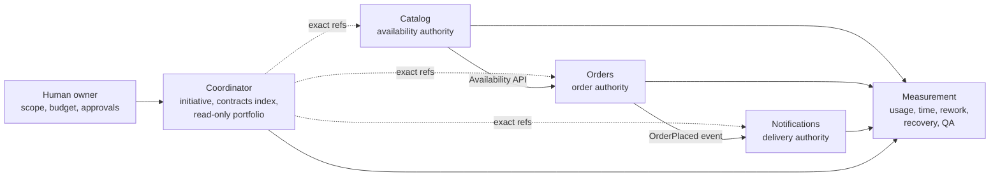

# Temple effectiveness and multi-repository validation plan

- Status: planning candidate; experiment not run
- Scope: local-first synthetic validation
- Public, production, GitHub, hosted CI, and paid actions: not authorized

## What this stage is for

Temple already has working local foundations for roles, Work Items, handoffs, retrieval, federation, telemetry, and a human-facing Workspace. The next useful step is not another feature or a release. It is a controlled rehearsal that can tell us what works, what fails, and what we can actually measure.

The experiment uses a small fictional commerce system so it can exercise realistic service boundaries without using company or production data.

Each service remains the only authority for its own lifecycle. The coordinator can show cross-service status and rollout order, but it cannot approve, close, or release a service Work Item.

## The five evidence levels

| Level | What we do | What we may conclude |
|---|---|---|
| 1. Instrumentation | Run one approved synthetic task through registration and usage observation. | Whether measurement is available, partial, or unavailable. |
| 2. Local rehearsal | Run four sibling repositories, exact contracts, failures, recovery, and QA. | Whether this bounded local scenario works. |
| 3. Longitudinal observation | Complete at least ten correctly correlated varied Work Items. | Which usage and coordination drivers appeared in this sample. |
| 4. Matched evaluation | Run predeclared equivalent task pairs with controlled model settings. | A bounded difference for the tested scenarios, with uncertainty. |
| 5. Collaborative qualification | Add several humans, machines, protected Git hosting, PRs, CI, and conflicts. | Whether that named enterprise-like scenario passes. |

Level 1 does not prove savings. Level 3 can identify patterns but not causality. Level 5 requires new permissions and is deliberately retained for later.

## Repositories and responsibilities

| Repository | Owns | Does not own |
|---|---|---|
| Coordinator | Experiment protocol, cross-service Initiative, domain map, contract index, rollout plan, read-only portfolio | Service lifecycle, credentials, local approvals, service releases |
| Catalog | Product availability API and implementation | Orders behavior or notification delivery |
| Orders | Order creation, state, and `OrderPlaced` event | Catalog availability authority or notification delivery |
| Notifications | Event consumption and delivery behavior | Order state or producer contracts |

The planned contract change intentionally requires a consumer-first rollout: Orders must accept both availability versions before Catalog switches its producer behavior. This tests whether Temple makes the dependency and rollback visible instead of relying on chat memory.

## Planned work

The execution plan contains 15 role-shaped Work Items across product specification, architecture, contract design, implementation, compatibility, integration, failure recovery, cold-task recovery, Independent QA, and evaluation. At least ten must complete with exact Work Item, task, revision, Position, model, and outcome correlation before the usage baseline becomes longitudinally qualified.

The work runs in waves:

1. Approve protocol, local paths, and budget.
2. Initialize four independent repositories and pin authority.
3. Design stable API and event contracts.
4. Implement disjoint service slices in safe parallel waves.
5. Run the consumer-first incompatible-contract rollout.
6. Inject stale, missing, overlapping, conflicting, and uncorrelated states.
7. Recover the project in a fresh task using repository evidence only.
8. Run exact-revision Independent QA and produce a limitation-aware report.

Parallel work starts only after claims, affected paths, shared contracts, resources, and integration ownership are recorded. A generated plan alone never creates or authorizes a Codex task.

## What will be measured

### Model usage

- input, cached-input, output, reasoning-output, and total Tokens when the provider reports them;
- requested and effective model, version or alias, reasoning effort, and service tier;
- exact Work Item, task, attempt, Position, lifecycle stage, revision, and outcome;
- missing fields and observation quality.

Reading provider usage metadata does not itself create model inference Tokens. Extra prompts, reports, and review tasks do consume Tokens and stay part of the observed workflow.

### Delivery and coordination

- elapsed, active, blocked, human-wait, and verification time;
- first-pass acceptance, defects, rework loops, retries, and abandoned attempts;
- context-resolution size and latency;
- cold-task recovery time and correctness;
- handoff clarification and human intervention;
- overlap detection, merge conflict, stale revision, contract drift, rollback, and QA outcome.

Token counts are a diagnostic signal, not a verdict. A design or Independent QA task may use more Tokens and still reduce total rework or risk.

## How we avoid proving our own marketing

- We predeclare acceptance, metrics, allocation, budget, and stop rules.
- Missing values remain unknown rather than becoming zero.
- The first rehearsal reports descriptive results only.
- A later comparison uses equivalent task pairs and holds model, reasoning, tools, repository conditions, and QA rules constant.
- We report failed tasks, exclusions, overhead, uncertainty, and limitations alongside successful results.
- The baseline keeps necessary specifications, tests, and safety gates; it is not intentionally weakened.
- No automatic model routing is enabled from these observations.

## Known measurement limitation

The current Alpha.27 usage qualification accepts one task/model/shape identity per Work Item. A Work Item with several correlated task identities is excluded rather than cherry-picked. Therefore the first rehearsal must say exactly whether a number describes one registered task or complete Work Item coverage. Multi-role aggregation needs a separately versioned implementation before any total-cost claim.

## Failure is useful evidence

The rehearsal deliberately tests:

- missing, dirty, stale, invalid, and identity-mismatched repositories;
- wrong composite references and incompatible contracts without rollout;
- overlapping write scopes and competing claims;
- producer-first breaking changes and rollback;
- missing task correlation or provider usage;
- model changes that invalidate a sample;
- the same identity attempting Developer and Independent QA;
- recovery without access to prior conversations.

Temple should reject, block, or label these conditions unknown. Silently repairing the fixture would fail the experiment.

## Approval and resource boundary

This plan creates nothing outside the current repository. A later execution requires explicit approval for:

- the experiment design and local repository locations;
- its Token, wall-clock, compute, and disk stop limits;
- every real Codex task wave;
- private GitHub repositories, hosted CI, or additional machines;
- sensitive or company data;
- any public, production, deployment, or release action.

The experiment stops when a ceiling is reached, correlation is lost, authority would be crossed, QA independence fails, or the owner withholds the next gate. Stopping with an honest limitation is a valid outcome.

## Decision after this plan

The planning review records that decision as `WI-0061`. The repository owner approved the exact local path, GPT-5.6 profile, Token, time, disk, retry, correlation, and stop boundaries in [the bounded instrumentation pilot proposal](../../.ai-org/artifacts/WI-0061/pilot-proposal.md) on 2026-08-31. Approval does not itself mean that the pilot has run; execution remains a separate, bounded Work Item.

WI-0062 subsequently ran that one-turn instrumentation pilot. It produced task-correlated detailed Token usage but remained `partial`: Temple had preserved the requested model while failing to read the Provider-acknowledged model from the documented top-level `thread/start` response. The four-repository experiment therefore remains blocked by the minimum model-correlation gate.

WI-0063 is the bounded local correction. It reads top-level model, reasoning-effort, and service-tier acknowledgement, normalizes `model/rerouted`, updates only an exactly correlated canonical task before later usage attribution, and preserves zero-retry and telemetry privacy boundaries. Local verification and Independent QA of that correction do not themselves rerun the pilot.

The next decision remains small and explicit after the WI-0063 candidate passes its local gates:

> Authorize one separately governed Provider-owned revalidation with the existing strict resource, privacy, retry, and correlation limits.

Only if that revalidation observes the requested-versus-effective model boundary, any reroute, and subsequent Token attribution correctly should Temple create the four-repository execution program.
