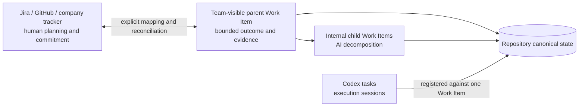

# Task and external tracker coordination

Temple separates company planning, AI execution, and conversation runtime so that each layer can change without pretending to be the others.



## The three layers

| Layer | Purpose | Canonical identity | What it must not decide |
|---|---|---|---|
| Company tracker | Human-visible planning, business assignment, priority, iteration, due date, and organizational commitments | Provider and external item ID | Temple lifecycle, evidence quality, Independent QA, or release readiness |
| Temple Work Item | Bounded execution scope, contracts, claims, lifecycle, evidence, and handoffs | `WI-*` | Business facts or external commitments without human authority |
| Codex task | One Agent execution session and its current status | Registered task/thread ID | Product truth, lifecycle completion, or durable project state by itself |

An AI Agent does not need a separate tracker account for every Agent Identity. The human or approved service credential controls external access. Agent Identity remains a repository concept for responsibility and evidence attribution. Credentials never belong in `.ai-org/project/tracker.json`.

## Profiles and mapping granularity

The project-owned `.ai-org/project/tracker.json` selects one profile:

- `repository-only`: no external provider is configured. Work Items and the task registry are sufficient.
- `linked-tracker`: selected Work Items link to external items, but Temple remains the execution and evidence system.
- `externally-planned`: the external tracker is the primary human planning surface. Temple still owns protected lifecycle and evidence fields.

The mapping granularity is independent:

- `parent-only`: map the company-visible outcome and keep all child decomposition internal.
- `team-visible`: map any Work Item intentionally marked `team-visible`; this is the default.
- `full`: expect every Work Item to be visible externally. Internal items produce attention signals until resolved.

Use the smallest granularity that lets humans coordinate. A company issue such as “Deliver checkout” may map to one parent Work Item while backend, frontend, migration, evaluation, and QA are separate internal children. Expose a child only when another person or team must schedule, own, review, or depend on it.

## Field ownership

Field ownership prevents silent two-way synchronization:

| Owner | Fields | Rule |
|---|---|---|
| Temple | lifecycle state, specification references, interface contracts, gate evidence, claim, tested revision, release decision | External values can be observed but never accepted as authority |
| External tracker | priority, iteration, estimate, due date, business assignee, labels | Preserve company workflow and report the observed value |
| Negotiated | title, parent relationship, dependencies | Report drift and require an explicit resolution |

External `done` or `cancelled` never advances a Work Item. The Developer handoff, test and evaluation evidence, Independent QA, exact candidate revision, and Release Gate remain required.

## Configure a provider

GitHub Issues has a bounded live read adapter through the authenticated `gh` CLI. Jira and generic providers use the same normalized observation contract, but currently require a supplied observation file.

```bash
temple tracker configure . \
  --tracker-profile linked-tracker \
  --sync-granularity team-visible \
  --provider-id github-main \
  --provider-kind github \
  --project owner/repository \
  --write-policy plan-only

temple tracker show .
temple doctor .
```

For Jira, provide its HTTPS base URL and choose manual reads:

```bash
temple tracker configure . \
  --tracker-profile externally-planned \
  --provider-id jira-company \
  --provider-kind jira \
  --project TEAM \
  --base-url https://example.atlassian.net \
  --read-policy manual \
  --write-policy disabled
```

The configuration records identity and policy only. Authenticate `gh` or any future adapter outside the repository. Do not add tokens, cookies, passwords, or environment values to the JSON file. Observations intentionally omit issue bodies, but titles, assignees, labels, and planning metadata may still be sensitive; apply the target repository's retention and access policy before committing reconciliation artifacts.

## Map visible outcomes and keep AI decomposition internal

A root Work Item defaults to `team-visible`; a child defaults to `internal`.

```bash
temple tracker link . \
  --work-item WI-0001 \
  --provider-id github-main \
  --item-id 381 \
  --url https://github.com/owner/repository/issues/381 \
  --role primary

temple work-item create . \
  --title "Implement the bounded backend slice" \
  --parent WI-0001 \
  --ui-mode not-applicable
```

Use `temple tracker set-visibility` before linking a child intentionally shared with the company. An `internal` Work Item cannot hold a direct tracker reference. Internal children inherit their ancestors' tracker references in generated Context Capsules for orientation; inheritance is not a new mapping.

A primary external item may belong to only one Work Item. Supporting references may be shared when several Work Items depend on the same external discussion.

## Inspect, plan, and reconcile

Inspection creates a bounded observation. It deliberately excludes issue bodies and credentials. Planning compares the observation with the Work Item and never writes externally.

```bash
temple tracker inspect . --work-item WI-0001 --no-write --json
temple tracker plan . --work-item WI-0001 --no-write --json
```

Without `--no-write`, the command updates the generated `.ai-org/views/tracker.json` projection and status. It still performs no external mutation.

A manual Jira or generic observation uses `temple.tracker-observation/v1` and records provider identity, external revision, title, normalized status, selected planning fields, timestamp, and adapter provenance. Reconciliation requires that reproducible file:

```json
{
  "schema_version": "temple.tracker-observation/v1",
  "provider_id": "jira-company",
  "provider_kind": "jira",
  "item_id": "TEAM-381",
  "url": "https://example.atlassian.net/browse/TEAM-381",
  "observed_at": "2026-08-30T02:00:00Z",
  "external_updated_at": "2026-08-30T01:55:00Z",
  "revision": "TEAM-381:2026-08-30T01:55:00Z",
  "title": "Deliver checkout",
  "status": "in_progress",
  "fields": {
    "priority": "High",
    "iteration": "Sprint 42",
    "estimate": "5",
    "due_date": null,
    "business_assignee": "human-owner",
    "labels": ["checkout"]
  },
  "source": { "kind": "file", "adapter": "jira-export-v1" }
}
```

```bash
temple tracker reconcile . \
  --work-item WI-0001 \
  --observation /absolute/path/to/observation.json \
  --resolution keep-temple \
  --reason "Release evidence is not complete"
```

Available resolutions are:

- `acknowledge`: valid only when no drift remains;
- `keep-temple`: record why repository truth remains unchanged;
- `accept-external`: accept negotiated values such as title, never Temple-owned fields;
- `defer`: preserve an unresolved item for later review.

Each reconciliation writes a project-owned artifact under `.ai-org/artifacts/tracker-reconciliations/`, links it from the Work Item, appends an event, and updates the generated view. Every artifact records `external_write_performed: false` in this release.

## Team responsibilities

- Product Manager defines the team-visible outcome and acceptance criteria. Business priority still requires the authorized human source.
- Engineering Manager decides decomposition, mapping granularity, provider mapping proposals, and reconciliation routing.
- Developers, designers, evaluators, and QA own their bounded Work Items; they do not create external commitments merely because a reference exists.
- Observer reports missing mappings, stale observations, and unresolved reconciliation actions without deciding the outcome.
- Human Principals authorize company truth, external commitments, and any future exact write-back.

## Current safety boundary

Alpha.15 can configure providers, link and unlink Work Items, read GitHub Issues, accept normalized manual observations, produce plans, record reconciliation evidence, route tracker context, and expose status and doctor findings. It cannot create, edit, assign, transition, comment on, or close an external tracker item. A configured `approved` write policy is a future permission ceiling, not present authorization or an implemented mutation path.

The framework intentionally keeps an adapter boundary for Jira, GitHub Projects, Asana, Linear, and other systems. Add a provider only with a pinned dependency or stable executable contract, license and security review, normalized observation tests, explicit field ownership, failure handling, and an ADR. See [ADR-0020](adr/0020-external-tracker-coordination.md).
